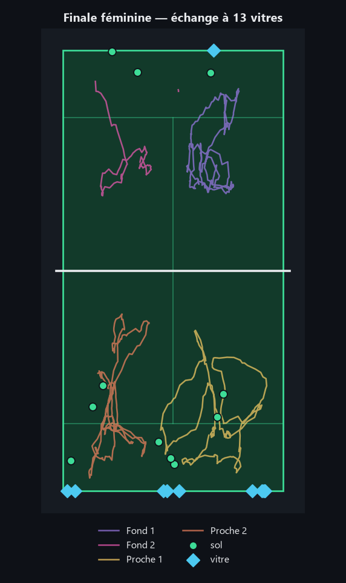
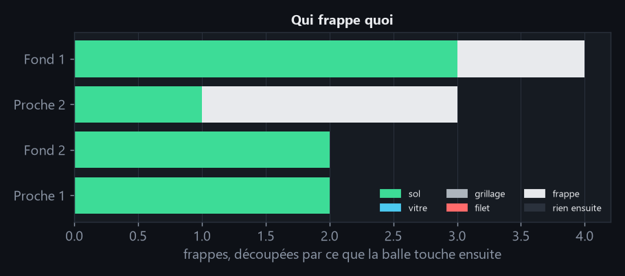
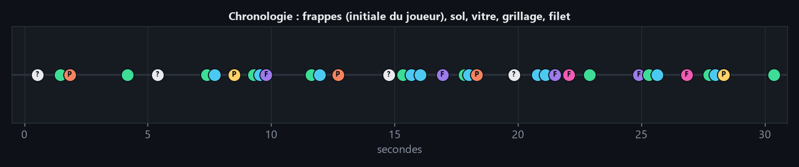
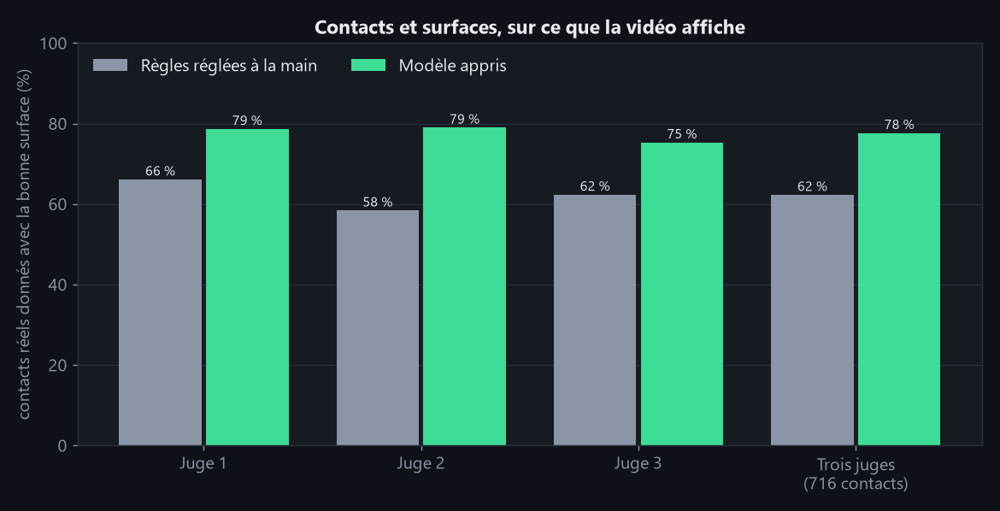
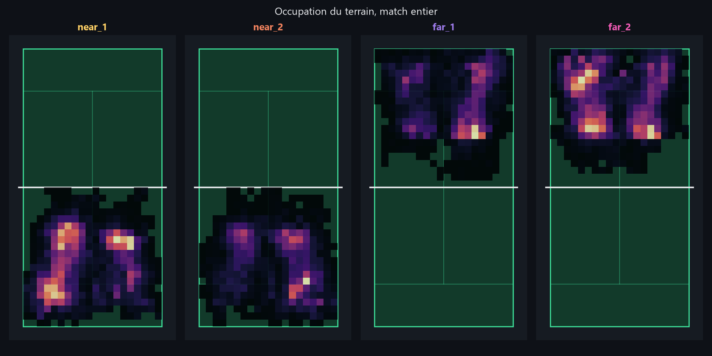
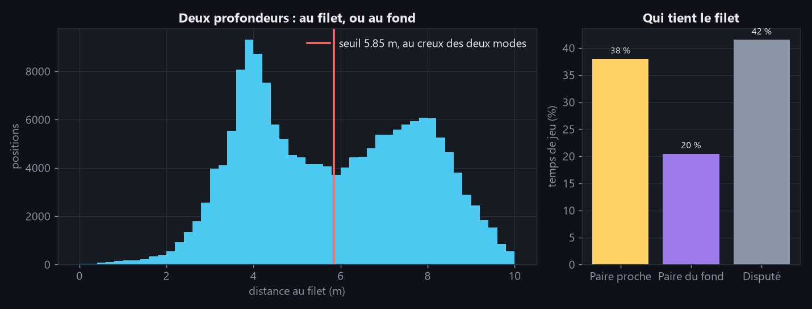

# Padel Analysis

Analyse de matchs de padel filmés par **une seule caméra** : les joueurs, la balle,
l'instant où elle est touchée, et **contre quoi elle rebondit** — sol, vitre, grillage,
filet ou raquette.

Le padel pose un problème que le tennis n'a pas : le court est fermé, et la balle
rebondit sur ses murs. Le projet le traite, et **mesure chaque étape** : il dit à quel
point ça marche, et où ça ne marche pas.

## Comment ça marche

1. **Du pixel au terrain.** Une calibration du court convertit chaque position de
   l'image en mètres.
2. **Les joueurs.** Détectés, suivis sur quatre emplacements, et projetés sur une
   minicarte du court, d'où sortent les statistiques tactiques.
3. **La balle.** Un réseau propose des candidats sur chaque image, puis le chemin le
   plus plausible est choisi **sur toute la séquence d'un coup**, et non image par image.
4. **Les contacts.** Un contact est un virage brusque de la trajectoire, ou le geste
   d'un joueur qui frappe.
5. **Les surfaces.** Une caméra ne voit pas la profondeur, mais au moment d'un contact
   la balle est **sur** une surface connue du court : le rayon de la caméra et le plan de
   cette surface se coupent en un point, qui donne la position en trois dimensions.
6. **La décision finale.** Un petit réseau temporel, entraîné sur des minutes de match
   pointées à la main, combine ces indices pour décider quels contacts afficher et sur
   quelle surface.

Une commande de démonstration assemble ces étapes dans une vidéo : joueurs et
minicarte, trace de la balle, et à chaque contact ce qui a été touché : la zone du
terrain — carré de service, fond, panneau de vitre ou de grillage, filet — s'éclaire en
perspective puis s'estompe, et lors d'une frappe c'est le joueur qui frappe qui
s'illumine, brièvement, en le suivant.

## Résultats

Tous les réglages sont faits sur la finale féminine ; la finale masculine ne sert qu'à
juger, une seule fois.

| Étape | Mesure | Match de réglage | Match tenu à l'écart |
|---|---|---|---|
| Joueurs | F1 de détection | 0,857 | **0,882** |
| Joueurs | Identité (IDF1) | 0,819 | 0,764 |
| Balle | Retrouvée à 10 px près | 0,815 | **0,798** |
| Contacts | Contacts détectés réels | 0,747 | **0,760** |
| Surfaces | Surface correcte | 0,828 | **0,821** |

Et **de bout en bout**, sur ce que la vidéo affiche : vingt minutes dont chaque contact
a été pointé à la main, dont neuf jamais regardées avant leur verdict.

| Contacts affichés avec la bonne surface | Validation croisée (863) | Juge 1 (239) | Juge 2 (238) | Juge 3 (239) | **Trois juges (716)** |
|---|---|---|---|---|---|
| Règles réglées à la main | 59,2 % | 66,1 % | 58,4 % | 62,3 % | 62,3 % |
| Modèle appris, premier verdict | 80,8 % | 78,7 % | 79,0 % | 75,3 % | 77,7 % |
| **Modèle, vitres déduites, 18 réseaux** | 83,2 % | 83,7 % | 82,8 % | 84,1 % | **83,5 %** |

Chaque juge est un lot de trois minutes pointées à la main, noté après que la chaîne a
été figée : une fois pour le premier verdict, une seconde fois pour le dernier, décidé
sans les regarder. 95 % de ce que la chaîne affiche au dernier juge est un contact
réel ; les vitres y sont justes à 61 %. Un quatrième juge, trois minutes pointées
après coup et jamais regardées, confirme : **83,0 %** des 247 contacts, vitres à 63 %,
97 % de ce qui est affiché réel.

Les juges ayant rendu leur verdict, leurs pointages ont rejoint l'entraînement : 23
minutes et 1 826 contacts au lieu de 11 et 863. En validation croisée, la chaîne passe
de 83,3 % à 87,1 % et 21 minutes sur 23 progressent. **Un cinquième juge, trois minutes
neuves, ne le confirme pas** : 82,2 % contre 81,8 % pour l'ancien modèle sur les mêmes
253 contacts, vitres 25 sur 38 contre 24. Le chiffre à retenir pour une minute jamais
vue reste donc autour de 82-83 %.

Quatre résultats valent d'être soulignés :

- **Choisir la balle sur toute la séquence** plutôt qu'image par image fait passer le
  rappel de 16 % à 72 % ; le réseau de détection le porte ensuite à 80 % sur le match
  jamais vu, contre 73 % avec la détection par mouvement.
- **La vérité terrain a été produite à la main** quand le dataset ne la fournissait pas :
  266 arbitrages d'identité, 344 jugements de surface et 1 579 contacts pointés sur
  vingt minutes de match, avec des outils qui n'affichent
  jamais ce que l'algorithme prédit.
- **Apprendre a battu régler.** Chaque seuil de la chaîne de contacts avait été
  balayé jusqu'au plateau ; un réseau qui voit tous les indices ensemble, aidé de la
  physique de la balle pour les vitres, donne la bonne surface à 83,5 % des contacts
  réels contre 62 % sur trois juges, et plus de 90 % de ce qu'il affiche est réel.
  Apprendre l'enchaînement de l'échange, en plus, n'apporte rien.
- **Le chiffre le moins flatteur était le bon.** Une vérité d'identité construite
  automatiquement annonçait un IDF1 de 0,956 et aucune erreur ; vérifiée à la main, elle
  en révèle quatre et descend à 0,819.

Le détail de chaque mesure, des ablations et des pièges évités est dans le
**[rapport d'évaluation](docs/evaluation.md)**.

## En images

Un échange de la finale féminine, pris dans des minutes que le modèle n'a jamais
vues : les déplacements des quatre joueuses, où la balle a touché le sol et les vitres,
et chaque contact dans l'ordre.

<p align="center">
  
  
</p>



Ce que valent ces contacts, mesuré contre un pointage fait à la main, et comment les
joueurs occupent le court sur un match entier :



<p align="center">
  
  
</p>

La courbe d'apprentissage et la confusion entre surfaces sont dans le
[rapport d'évaluation](docs/evaluation.md#de-bout-en-bout--ce-que-la-démonstration-affiche).

## Limites

- **Pas de temps réel** : c'est une analyse après match, à quelques images par seconde
  sur une GTX 1650.
- **Une seule caméra** : un contact haut sur la vitre proche et un rebond au sol peuvent
  occuper le même pixel, et ne se distinguent pas au-delà d'environ un mètre.
- **Deux matchs, un tournoi, un angle** : rien n'établit que le pipeline transfère à un
  autre court ou à une autre caméra.
- **Le suivi d'identité se dégrade** sur le match tenu à l'écart, où les joueurs se
  croisent plus souvent de près, et ne traverse pas un changement de côté.
- **Grillage et filet ne sont pas mesurables** : quelques exemples seulement.
- **Un contact sur cinq reste faux ou manqué** sur ce que la démonstration affiche,
  et la vitre est le point faible : la moitié seulement des contacts sur la vitre
  sont retrouvés.
- **Un seul annotateur** pour les vérités terrain produites à la main.

## Installation

```bash
conda create -n padel python=3.11 -y
conda run -n padel pip install torch torchvision --index-url https://download.pytorch.org/whl/cu121
conda run -n padel pip install -e ".[dev]"
```

L'installation explicite de torch CUDA n'est pas optionnelle sous Windows : le torch
tiré par défaut est une version CPU, et l'inférence passerait de minutes à heures.

Les tests et le linter :

```bash
conda run -n padel python -m pytest -q
conda run -n padel ruff check src tests scripts
```

## Utilisation

Télécharger le dataset PadelTracker100 (8,2 Go) :

```bash
python scripts/download_dataset.py
```

Calibrer le court sur une frame. Treize points sont demandés ; un schéma du court et
une loupe 5× s'affichent dans la fenêtre pour guider chaque clic :

```bash
python scripts/calibrate.py --video <video.mp4> --frame 200 --out ground_truth/calibrations/<nom>.json
```

Vérifier visuellement la calibration en superposant le modèle du court :

```bash
python scripts/overlay_court.py --video <video.mp4> --frame 200 \
    --calibration ground_truth/calibrations/<nom>.json --out outputs/overlay.png
```

Lancer la chaîne complète — vidéo annotée avec minimap, et positions mises en cache :

```bash
python -m padel_analysis.cli --video <video.mp4> \
    --calibration ground_truth/calibrations/<nom>.json \
    --out outputs/annotated.mp4 --cache cache/<nom>.json --start 5000 --frames 1800
```

Pour un passage destiné aux statistiques, `--no-video` saute le rendu et ne produit
que le cache. Un match entier prend alors environ une heure sur une GTX 1650 :

```bash
python -m padel_analysis.cli --video <video.mp4> \
    --calibration ground_truth/calibrations/<nom>.json --cache cache/<nom>.json --no-video
```

Puis calculer les statistiques et les figures depuis ce cache, sans réinférence :

```bash
python -m padel_analysis.analyse --cache cache/<nom>.json \
    --out outputs/<nom>_report.json --figures outputs/
```


La vidéo de démonstration demande les poids du réseau de détection de balle. Elle
analyse toute la plage avant de dessiner, puisque la balle est choisie sur la séquence
entière. Ses contacts viennent du chemin reconstruit et non de positions annotées : elle
en montre donc plus qu'il n'y en a eu, sauf avec le modèle de contacts, qui les
décide à partir de tous les indices à la fois. Pour l'affichage seulement, la balle est masquée
là où le réseau n'est pas sûr de lui : mesuré sur une minute annotée, les trajectoires
fantômes — balle hors champ, balle en main avant le service — passent de 222 images à 36,
pour 97,5 % des positions justes conservées. Les contacts de mur dont le rayon ne
rencontre qu'une seule surface sont aussi masqués : sur les deux matchs annotés, ils
portent 38 des 42 faux murs, pour 2 vrais murs sur 33. Les chiffres mesurés ne sont pas
filtrés.

```bash
python -m padel_analysis.demo --video <video.mp4> \
    --calibration ground_truth/calibrations/<nom>.json \
    --weights weights/ball_net.pt --start 16000 --frames 1800 --out outputs/demo.mp4 \
    --contact-model weights/contact_net.pt
```

Le modèle de contacts s'entraîne sur les minutes pointées, et se note sur les minutes de
juge, qui ne servent qu'une fois :

```bash
python scripts/analyse_minutes.py --weights weights/ball_net.pt --tag 360
python scripts/train_contact_model.py --cv --out weights/contact_net.pt
python scripts/score_minutes.py --tag 360 --contact-model weights/contact_net.pt --juge
```

Une page de statistiques par échange met la vidéo et les chiffres côte à côte : frise
des contacts, plan du court animé, frappes par joueur, vitesse de la balle,
déplacements. Chaque panneau s'affiche ou se masque, un clic sur un contact fait sauter
la vidéo à cet instant, et un mode vérité compare la détection au pointage fait à la
main. Les échanges se choisissent dans `config/rallies.json`. La page et ses extraits
vidéo sont écrits dans `outputs/rallies/`, hors du dépôt, et demandent ffmpeg :

```bash
python scripts/rally_page.py --contact-model weights/contact_net.pt
```

Les figures ci-dessus se refont depuis les chiffres écrits par les scripts de mesure :

```bash
python scripts/train_contact_model.py --cv --curve --results outputs/measures/cv.json \
    --out weights/contact_net_rerun.pt
python scripts/make_figures.py --cache cache/<match entier>.json
```

Les commandes qui reproduisent chaque mesure sont dans le
[rapport d'évaluation](docs/evaluation.md#reproduire-lévaluation).

## Données

Ce projet utilise le dataset PadelTracker100 (Zenodo, DOI 10.5281/zenodo.14653706),
distribué sous licence CC-BY-4.0. Il contient deux matchs des World Padel Tour
Finals 2022 en 1920×1080@30, avec annotations COCO de pose (17 keypoints),
de balle et d'événements de frappe.

Les annotations de pose n'utilisent pas l'ordre COCO standard : gauche et droite y
sont inversés pour toutes les articulations appariées sauf les oreilles. Le module
`perception/keypoints.py` effectue la conversion, et la teste.


## Licence

AGPL-3.0. Voir `LICENSE`.

Ce projet dépend d'Ultralytics, distribué sous AGPL-3.0, ce qui impose cette licence
à l'ensemble. Le code n'est donc pas réutilisable dans un produit propriétaire.
