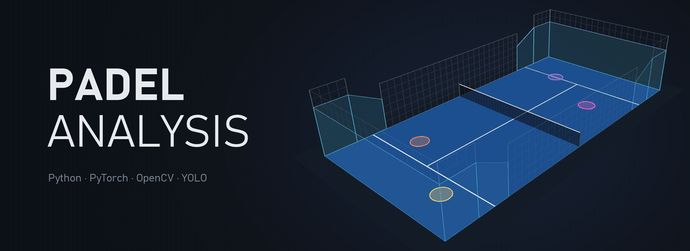
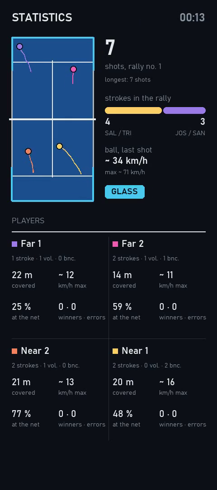
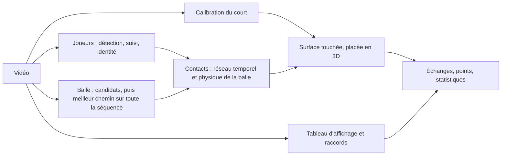
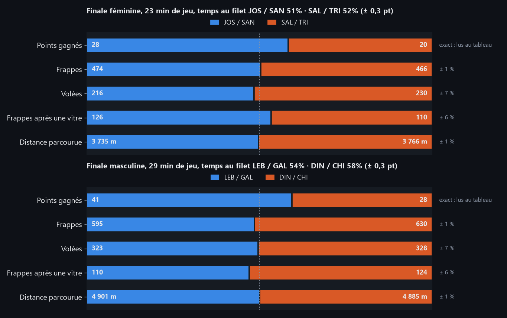
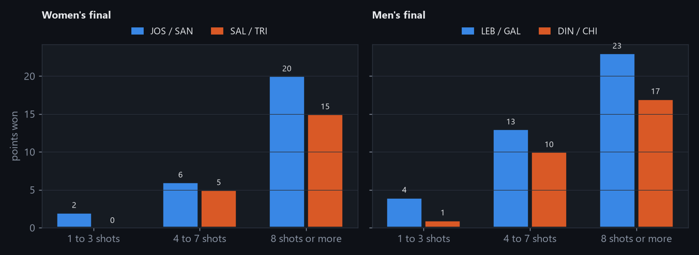
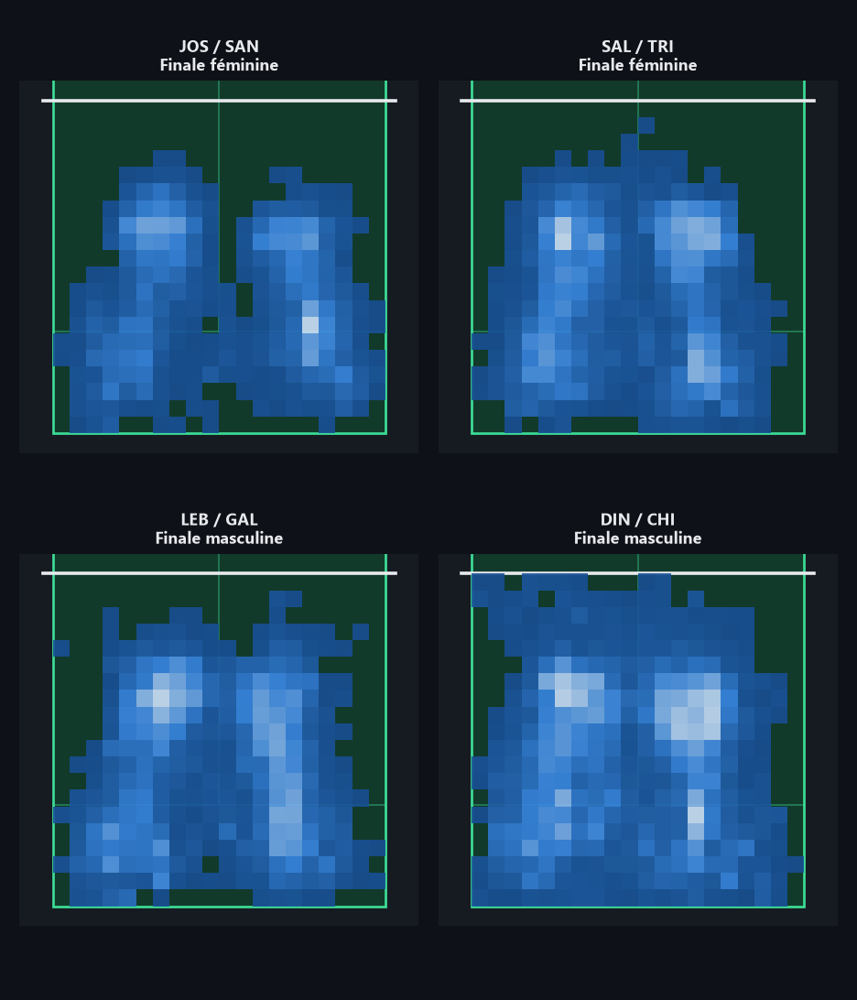

<p align="center">
  
</p>

# Padel Analysis

> 🇬🇧 [English version](README.en.md)

Analyse de matchs de padel filmés par **une seule caméra** : les joueurs, la balle,
chaque contact et **ce que la balle a touché** (raquette, sol, vitre, grillage ou
filet), puis **les statistiques du jeu** : distance parcourue, vitesse, temps au filet,
frappes et volées, par joueur sur un échange et par paire sur un match.

**82 à 83 %** des contacts reconnus avec la bonne surface sur des minutes jamais vues ·
**86 %** sur un tournoi jamais vu · la distance d'une paire **à 1 % près** sur un match
entier · vérifié contre plus de **2 000 contacts pointés à la main**.

## Le projet en une minute

https://github.com/user-attachments/assets/d661c68a-3d02-4013-a0c8-071019c78d98

<sub>Avec le son. L'échange du film, ses contacts et ses statistiques sont ceux que le
projet a mesurés ; entre deux contacts, la trajectoire de la balle en 3D est une
illustration. Images : dataset PadelTracker100 (CC-BY-4.0), retransmission World Padel
Tour.</sub>

## Ce que produit le projet

https://github.com/user-attachments/assets/a1eb8fcd-89af-4678-96fa-427a242407b9

<sub>L'échange en entier, tel que le projet le rend : les joueurs suivis, la balle, la
zone touchée à chaque contact et le panneau de statistiques. Images : dataset
PadelTracker100 (CC-BY-4.0), retransmission World Padel Tour.</sub>

Une vidéo de l'échange avec, à côté, un panneau qui avance avec le jeu : la minicarte
des joueurs, le numéro et la longueur de l'échange, les frappes de chaque paire dans
l'échange, les points lus au tableau d'affichage et crédités au dernier frappeur, et
pour chaque joueur ses frappes, ses volées, la distance parcourue, sa vitesse maximale
et son temps au filet. À chaque contact, la zone touchée (carré de service, fond,
panneau de vitre) s'éclaire en perspective.

<p align="center">
  
</p>

## Comment ça marche



- **La balle est choisie sur toute la séquence**, et non image par image : le rappel
  passe de 16 % à 72 %, puis à 80 % avec un réseau de détection entraîné.
- **Les contacts** sont décidés par un petit réseau temporel, entraîné sur des minutes
  pointées à la main, qui combine la trajectoire, les gestes des joueurs et la géométrie
  du court.
- **Les vitres que l'image ne montre pas se déduisent de la physique** : une balle trop
  lente pour avoir rejoint le joueur directement après son rebond est passée par la
  vitre (juste 13 fois sur 14).
- **Une caméra ne voit pas la profondeur**, mais au moment d'un contact la balle est sur
  une surface connue du court : le rayon de la caméra la place en trois dimensions.

## Résultats

| Étape | Mesure | Sur des données jamais vues |
|---|---|---|
| Joueurs | Détection (F1) | 0,88 |
| Joueurs | Identité suivie (IDF1) | 0,84 |
| Balle | Retrouvée à 10 px près | 80 % |
| **Contacts, de bout en bout** | **Bonne surface** | **82-83 %** |
| dont frappes · rebonds · vitres | Bonne surface | 93 % · 78 % · 64 % |
| Autre tournoi, autre salle | Bonne surface | 86 % |

La démarche, sur 716 contacts pointés : des règles réglées à la main donnent **62 %**,
un modèle appris **78 %**, la physique des vitres et un ensemble de 18 réseaux **83 %**.
Chaque chiffre est mesuré sur des minutes **jamais regardées pendant les réglages** ;
quand la validation croisée a promis 87 % et qu'un juge neuf a répondu 82 %, c'est 82 %
qui est retenu.

Le détail (mesures, ablations, essais abandonnés et pourquoi) est dans le
**[rapport d'évaluation](docs/evaluation.md)**.

## Le bilan d'un match

Les deux finales analysées en entier, par paire : les points lus au tableau
d'affichage, les frappes, les volées, les frappes après une vitre, la distance
parcourue et le temps au filet. Chaque chiffre est vérifié : les déplacements contre
les positions annotées du dataset (à 1 % près), les frappes contre les minutes pointées
à la main (à 1 % près ; les volées à 7 %), les points contre le tableau.



<p align="center">
  
  
</p>

Le bilan est donné **par paire, pas par joueur** : quand le suivi confond deux
partenaires, la somme de la paire reste juste, mais la distance d'un joueur est fausse
de plus de 12 % une fois sur dix. Les équipes sont suivies d'un changement de côté à
l'autre par le score, qui dit quand elles changent ; le bilan part donc de la première
lecture du tableau. L'occupation est repliée sur une moitié : le filet en haut.

## Limites

- **Analyse après match**, à quelques images par seconde sur une GTX 1650.
- **Une seule caméra** : au fond du court, un rebond sur la vitre ne déplace la balle
  que de quelques pixels, et un tiers de ces vitres restent manquées. Le son ne les
  rattrape pas : testé, elles sont silencieuses dans l'enregistrement de diffusion.
- **Le transfert à un autre court** est montré sur un seul échange, pas sur un match.
- **L'identité des joueurs** se perd aux raccords de la retransmission, surtout chez
  les hommes.
- **Grillage et filet** sont trop rares pour être appris.
- **Un seul annotateur** pour toute la vérité terrain pointée à la main.

## Démarrage rapide

```bash
conda create -n padel python=3.11 -y
conda run -n padel pip install torch torchvision --index-url https://download.pytorch.org/whl/cu121
conda run -n padel pip install -e ".[dev]"
conda run -n padel python -m pytest -q
```

L'installation explicite de torch CUDA n'est pas optionnelle sous Windows : le torch
tiré par défaut est une version CPU, et l'inférence passerait de minutes à heures.

```bash
python scripts/download_dataset.py
python scripts/analyse_minutes.py --weights weights/ball_net.pt --tag 360 --match FinalF --minute 8000
python scripts/stats_video.py --match FinalF --minute 8000 --start 9084 --stop 9799 \
    --contact-model weights/contact_net.pt --out outputs/stats.mp4 --replay
```

Toutes les autres commandes (calibrer un court, pointer des contacts, entraîner et
juger le modèle, refaire les figures) sont dans **[docs/utilisation.md](docs/utilisation.md)**.

## Données et crédits

- **[PadelTracker100](https://doi.org/10.5281/zenodo.14653706)** (CC-BY-4.0) : deux matchs
  des World Padel Tour Finals 2022 en 1920×1080 à 30 images par seconde, avec les poses
  des joueurs, la balle et les frappes annotées. Ses annotations de pose inversent
  gauche et droite pour toutes les articulations appariées sauf les oreilles ;
  `perception/keypoints.py` les remet dans l'ordre COCO.
- **Decorte et al.**, *Multi-Modal Hit Detection and Positional Analysis in Padel
  Competitions*, CVPR Workshops 2024 : un échange de leur jeu de données a servi au test
  sur un autre tournoi.
- Aucune vidéo, image de retransmission ni poids de réseau n'est versionné.

## Licence

AGPL-3.0, voir `LICENSE`. Le projet dépend d'Ultralytics, distribué sous AGPL-3.0, ce
qui impose cette licence à l'ensemble : le code n'est pas réutilisable dans un produit
propriétaire.
