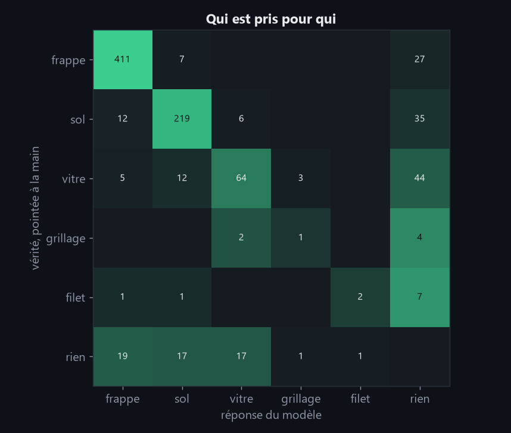
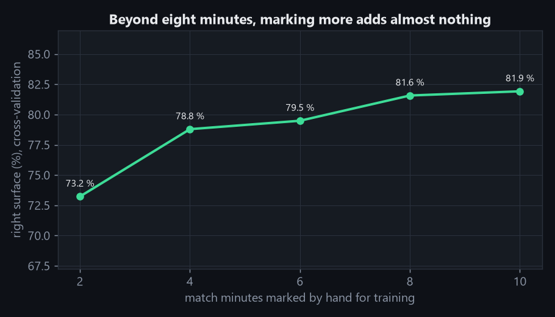
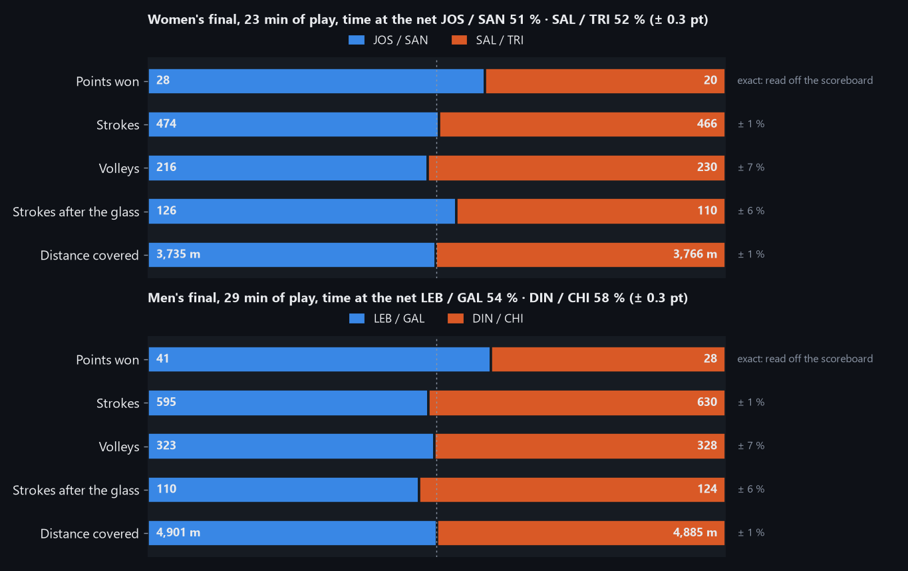
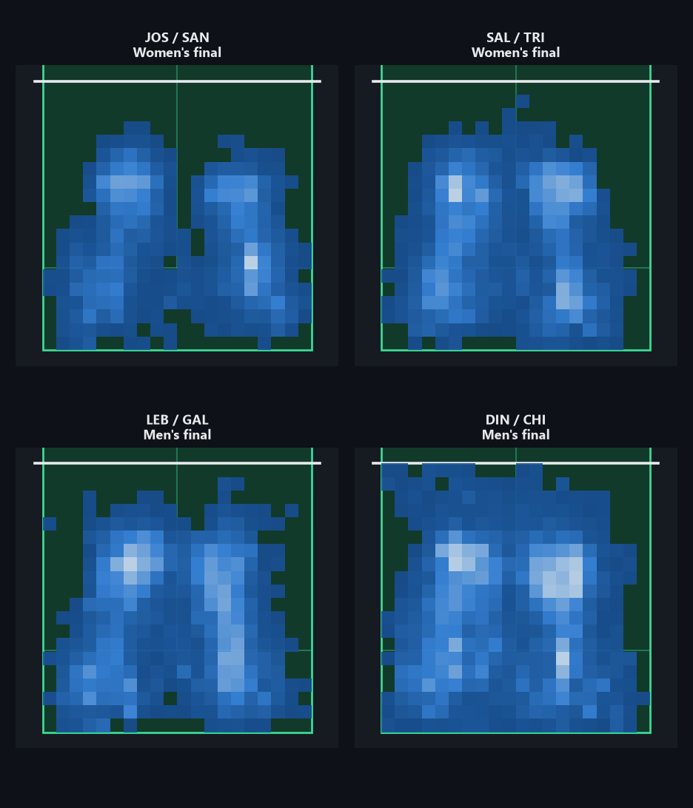

# Padel Analysis : rapport d'évaluation

> 🇬🇧 [English version](../en/evaluation.md)

Ce document détaille chaque mesure résumée dans le [README](README.md) : comment elle a été obtenue, ce qu'elle vaut, et ce qu'elle ne dit pas. Les chiffres portent sur deux matchs du dataset PadelTracker100 : la finale féminine sert à régler, la finale masculine n'est utilisée qu'une fois, pour juger.

## Résultats

### Stabilité de la caméra

Homographie ORB + RANSAC entre la première frame et les suivantes, sur 407 frames :

| Mesure | Valeur |
|---|---|
| Déplacement maximal des coins de l'image | **0,02 px** |

La caméra de diffusion est fixe. Une seule calibration suffit par vidéo.

### Précision de la calibration

Treize points cliqués, dont **quatre points de contrôle exclus de l'ajustement** et
répartis sur l'ensemble du court, pour que l'erreur rapportée ne soit pas optimiste.

| Mesure | Pixels | Centimètres |
|---|---|---|
| RMSE | 3,66 | 11,6 |
| Médiane | 3,66 | 9,9 |

Détail par point de contrôle :

| Point | Erreur (px) | Erreur (cm) |
|---|---|---|
| Ligne de service proche, centre | 2,78 | 3,1 |
| Filet, paroi droite | 4,34 | 7,4 |
| Filet, centre | 3,95 | 12,4 |
| Ligne de service éloignée, centre | 3,37 | 17,8 |

### Asymétrie de précision entre les deux moitiés du court

L'erreur en pixels est uniforme (2,8 à 4,3 px). L'erreur en mètres ne l'est pas,
parce que l'échelle varie fortement avec la profondeur :

| Position sur le court | Centimètres par pixel |
|---|---|
| Fond proche | 1,51 |
| Ligne de service proche | 2,05 |
| Filet | 3,56 |
| Ligne de service éloignée | 5,49 |
| Fond éloigné | 6,47 |

**Un pixel vaut 4,3 fois plus au fond éloigné qu'au fond proche.** Cette asymétrie
est une propriété de la prise de vue, pas un défaut de la méthode : elle affecte
toute estimation de position, quelle que soit la façon dont elle est obtenue.

Deux conséquences pour la suite :

- Les positions des joueurs de la moitié éloignée sont intrinsèquement quatre fois
  plus bruitées que celles de la moitié proche.
- Le bruit gonfle les distances parcourues mesurées. La comparaison entre les deux
  équipes n'est donc pas symétrique à l'intérieur d'un même jeu.

### Résolution d'inférence

L'entrée du modèle est redimensionnée avant inférence. Mesuré sur 300 frames
annotées, soit 1200 joueurs à retrouver, en comparant le milieu des chevilles
prédit aux chevilles annotées :

| imgsz | ms/frame | Erreur (px) | Moitié proche (cm) | Moitié éloignée (cm) | Joueurs retrouvés |
|---|---|---|---|---|---|
| 640 | 41 | 4,03 | 6,4 | 34,3 | 572 / 1200 |
| 960 | 38 | 2,70 | 4,7 | 7,9 | 745 / 1200 |
| 1280 | 59 | 2,46 | 4,4 | 7,1 | 1170 / 1200 |
| **1600** | **90** | **2,06** | **3,8** | **6,2** | **1200 / 1200** |

**La colonne décisive est la dernière.** La résolution ne gouverne pas seulement la
précision, elle gouverne le **rappel** : à 640 pixels le modèle ne retrouve que 48 %
des joueurs. Ceux du fond du court, hauts d'une centaine de pixels et fréquemment
occultés par leur partenaire, disparaissent purement et simplement. L'erreur médiane
de 4 px affichée à 640 ne le révèle pas, puisqu'elle ne porte que sur les joueurs
effectivement trouvés.

**Résolution retenue : 1600.** Elle retrouve tous les joueurs, et son erreur au fond
du court (6,2 cm) passe sous l'erreur de calibration (9,9 cm) : affiner davantage la
perception n'améliorerait plus rien, le plancher étant géométrique.

### Perception et suivi

Mesuré sur 1800 frames consécutives, soit une minute de jeu :

| Mesure | Valeur |
|---|---|
| Cadence de la chaîne complète (GTX 1650, 4 Go) | 9,7 frames/s |
| Frames à quatre joueurs identifiés | **96,50 %** |
| Référence : frames à quatre personnes annotées | 99,94 % |
| Positions hors du court en `x` | 0,00 % |

Le même pipeline à `imgsz` 1280 n'atteignait que 92,33 % : la résolution explique
l'essentiel de l'écart.

Une observation dont la position projetée sort largement de l'enceinte est refusée.
Sans cette borne le taux affiché montait à 97,94 %, mais la différence tenait à des
frames où un spectateur du bon côté du filet occupait un emplacement libre : le
chiffre était flatteur et faux. Le refus a aussi séparé les deux emplacements du
fond, dont les positions moyennes étaient confondues parce que ces intrus les
occupaient par intermittence.

L'identité est maintenue par appariement hongrois sur quatre emplacements fixes, deux
de chaque côté du filet. Le côté vient du signe de la coordonnée `y` après projection :
la calibration alimente donc directement le suivi. Le coût d'assignation combine la
distance à la position prédite par un modèle à vitesse constante, la signature de
couleur de la tenue et la confiance des chevilles.

Cette contrainte structurelle n'est pas décorative : **le détecteur trouve plus de
quatre personnes dans 63 % des frames** (spectateurs, ramasseurs de balle, arbitre),
et le suivi contraint retient systématiquement les quatre bonnes.

La signature de couleur a été validée par la mesure avant d'être conservée : la
dérive d'un même joueur d'une frame à l'autre vaut 0,031, contre 0,199 entre deux
partenaires. Le rapport de 6,3 confirme qu'elle distingue bien des coéquipiers
portant la même tenue, et pas seulement les deux équipes.

### Analyse tactique : contrôle du filet

Mesuré sur le match complet, 45 934 frames, dont 44 911 portent les quatre joueurs.

Les joueurs occupent deux profondeurs distinctes. Sur 182 713 positions, le mode
offensif culmine à **3,95 m** du filet et le mode défensif à **7,85 m**, contre la
vitre de fond. Le creux qui les sépare tombe à **5,85 m**, et c'est là qu'est placé le
seuil.

La ligne de service, à 6,95 m, n'est délibérément pas utilisée : c'est une règle de
service et non un marqueur de position tactique, et elle tombe du mauvais côté du
creux : elle classerait toute la bande défensive comme offensive.

| Mesure | Valeur |
|---|---|
| Contrôle côté proche | **38,0 %** |
| Contrôle côté éloigné | **20,5 %** |
| Disputé | 41,5 % |
| Frames évaluées | 44 911 |

**Le creux est large et peu profond**, donc la valeur exacte du seuil relève en partie
de la convention, et les pourcentages la suivent :

| Seuil | Proche | Éloigné | Disputé | Rapport proche/éloigné |
|---|---|---|---|---|
| 5,00 m | 28,0 % | 12,3 % | 59,8 % | 2,28 |
| 5,50 m | 33,9 % | 18,0 % | 48,2 % | 1,88 |
| **5,85 m** | **38,0 %** | **20,5 %** | **41,5 %** | **1,85** |
| 6,00 m | 39,7 % | 21,4 % | 38,9 % | 1,86 |
| 6,50 m | 43,5 % | 23,5 % | 33,0 % | 1,85 |

Les valeurs absolues dépendent donc du seuil, mais **le rapport entre les deux paires
ne bouge pratiquement pas** au-delà de 5,5 m. La conclusion robuste de ce match est
que la paire du côté proche a tenu le filet environ **1,85 fois plus souvent** que
l'autre, indépendamment de la convention retenue.

### Analyse tactique : distance et vitesse

La distance est donnée brute et lissée. L'écart entre les deux chiffre la part qu'y a
prise le bruit de position, au lieu de la masquer.

| Emplacement | Moitié | Distance brute | Distance lissée | Part de bruit | Vitesse p95 | Profondeur moyenne |
|---|---|---|---|---|---|---|
| near_1 | proche | 2890 m | 2261 m | **21,8 %** | 3,50 m/s | 5,41 m |
| near_2 | proche | 2807 m | 2210 m | **21,3 %** | 3,51 m/s | 5,44 m |
| far_1 | éloignée | 3282 m | 2233 m | **32,0 %** | 3,77 m/s | 6,75 m |
| far_2 | éloignée | 3300 m | 2285 m | **30,8 %** | 3,92 m/s | 6,77 m |

**Ces lignes sont des emplacements, pas des joueurs.** Les quatre emplacements
désignent deux positions de chaque côté du filet, et les équipes changent de côté
sept fois au cours de ce match : `near_1` est donc successivement plusieurs personnes.
Ces distances agrègent le trajet parcouru *à cet endroit du court*, ce qui reste une
mesure valide et interprétable, mais ce n'est pas une distance par joueur. La section
[Évaluation](#évaluation) explique pourquoi suivre un joueur à travers un changement
de côté est hors de portée de l'image seule.

**La part de bruit est une demi-fois plus élevée pour la moitié éloignée**, ce que
prédit l'asymétrie de 4,3× documentée plus haut. Les distances lissées, elles, sont
comparables entre les quatre emplacements alors que les distances brutes ne l'étaient
pas : l'écart apparent de 400 mètres entre les deux paires était du bruit, pas du jeu.

## Évaluation

Les mesures qui suivent comparent la sortie du pipeline aux annotations du dataset
sur 9 000 frames, soit cinq minutes de jeu. **Les deux ablations sortent du même
passage sur la vidéo** : aucune comparaison ne peut être faussée par un échantillon
différent.

### Détection

| Mesure | Valeur |
|---|---|
| Précision | 0,778 |
| **Rappel** | **0,954** |
| F1 | 0,857 |
| Personnes prédites | 44 134 |
| Personnes annotées | 36 006 |
| Appariées (IoU ≥ 0,5) | 34 338 |

La précision de 0,778 ne dit pas que le détecteur se trompe. Il trouve **8 000
personnes de plus qu'il n'y a de joueurs annotés** : arbitre, ramasseurs de balle,
premiers rangs du public. Ces détections sont correctes, elles ne sont simplement pas
des joueurs. C'est le rôle du suivi contraint de les écarter, et c'est ce que mesure
l'ablation 2.

Le rappel est donc la mesure qui compte ici : **95,4 % des joueurs annotés sont
retrouvés**.

### Ablation 1 : d'où vient le point au sol

Deux façons de décider où un joueur touche le sol : le milieu de ses chevilles, ou le
centre du bord inférieur de sa boîte englobante. Les deux implémentations coexistent
dans le code pour que le choix soit tranché par la mesure.

| Stratégie | Global | Moitié proche | Moitié éloignée |
|---|---|---|---|
| **Milieu des chevilles** | **1,89 px** | 2,01 px (3,0 cm) | 1,77 px (**11,5 cm**) |
| Bas de la boîte | 19,61 px | 24,19 px (36,5 cm) | 16,64 px (**107,7 cm**) |

Sur 34 338 échantillons appariés, **les chevilles font dix fois mieux**. Le bas de la
boîte englobante n'est pas l'endroit où le joueur touche le sol : c'est le point le
plus bas de l'englobant, qui inclut la raquette baissée et un pied levé.

L'écart est plus grand en pixels près de la caméra, et plus grand en mètres au fond du
court : les deux lectures sont vraies, et c'est l'asymétrie de 4,3× qui les sépare. Un
mètre d'erreur au fond avec le bas de la boîte, c'est la moitié d'une zone de service.

### Vérité terrain d'identité

Le dataset donne quatre personnes par frame mais ne dit jamais laquelle est laquelle.
Reconstruire cette information est presque gratuit : sur un match entier, deux
partenaires ne s'approchent **jamais** à moins de cinquante centimètres. La machine
associe donc au plus proche voisin sur tout le match, et un humain n'arbitre que les
moments où ça devient douteux.

Mais cette association suppose une image continue, et elle ne l'est pas. **La vidéo du
dataset est une concaténation des séquences de jeu**, temps morts retirés. Le tableau
d'affichage le prouve : entre deux frames consécutives, le score passe de 30 à 40.

À chaque raccord, les joueurs réapparaissent ailleurs. Ce n'est pas un rapprochement
(ils ne se frôlent pas, ils se téléportent), donc rien ne paraît ambigu, et l'identité
peut changer en silence.

| | rapprochements | raccords | changements de côté |
|---|---|---|---|
| Final féminine | 14 | 83 | 7 |
| Final masculine | 54 | 115 | 8 |

**266 clips arbitrés à la main**, chacun rejoué en boucle avec les quatre joueurs
encadrés de leur couleur d'emplacement.

Détecter ces raccords demande un critère contre-intuitif. Exiger que **les deux**
joueurs d'une paire bougent semble plus sûr, et c'est exactement l'inverse :
l'association au plus proche voisin minimise le déplacement apparent, donc une paire
qui échange ses places à un raccord produit le signal « ils n'ont pas bougé ». Le
critère strict est aveugle aux cas qu'il devrait attraper. Un seul joueur au-dessus du
seuil suffit donc, et la tolérance croît avec le temps écoulé : huit mètres en trois
frames manquantes est un raccord, dix mètres en soixante-dix-sept est un joueur qui
court.

Un changement de côté, lui, n'est pas une erreur à corriger. Les emplacements
désignent une moitié de court : quand les équipes changent de côté, `near_1` est
quelqu'un d'autre, et aucun échange d'étiquettes ne peut l'exprimer. **L'identité
s'arrête là et repart** : les métriques d'identité coupent des deux côtés de la
comparaison à cet endroit, et ne créditent ni ne pénalisent personne pour une
frontière qu'aucune information de l'image ne permet de franchir.

### Ablation 2 : la contrainte de court

Le suivi contraint tient exactement quatre emplacements, deux de chaque côté du filet,
et refuse toute position hors de l'enceinte. La ligne de base est ByteTrack, sans
aucune de ces contraintes.

| | Pistes moy. | Frames > 4 pistes | MOTA | IDF1 | Permutations |
|---|---|---|---|---|---|
| **Suivi contraint** | **3,98** | **0** | **0,912** | **0,819** | **4** |
| ByteTrack seul | 4,78 | 5 152 | 0,704 | 0,281 | 67 |

**ByteTrack dépasse quatre pistes sur 5 152 frames des 8 990 évaluées**, plus d'une
sur deux. Rien ne le borne, et le détecteur lui fournit huit mille personnes de trop.
L'IDF1 de 0,281 signifie que la plupart des identités de référence ne sont couvertes
par aucune piste stable : des statistiques par joueur calculées là-dessus seraient du
bruit.

### Ce que l'arbitrage change à la mesure

La vérité terrain d'identité peut être construite automatiquement, sans arbitrage
humain. Elle donne alors ceci, sur exactement les mêmes frames et le même code :

| | Sans arbitrage | Après arbitrage |
|---|---|---|
| MOTA | 0,913 | 0,912 |
| **IDF1** | **0,956** | **0,819** |
| **Permutations d'identité** | **0** | **4** |

**La version automatique annonce zéro permutation. Il y en a quatre.**

L'explication tient en une phrase : l'association au plus proche voisin qui construit
la référence est la même hypothèse que celle du tracker évalué. Aux raccords, les deux
se trompent ensemble, et la métrique compare une erreur à elle-même. L'IDF1 était
surestimé de 0,137.

MOTA ne bouge pas (0,913 → 0,912), ce qui est cohérent : il est dominé par les faux
positifs et les manques de détection, pas par l'identité. **Il fallait IDF1 pour voir
le problème, et une référence indépendante pour qu'IDF1 puisse le dire.**

Sur ces 9 000 frames il y a 18 raccords, 3 rapprochements et 1 changement de côté :
le suivi contraint décroche 4 fois sur 21 occasions, ByteTrack 67 fois.

### Phases aériennes

Un point à hauteur `h` projeté par une homographie de sol atterrit à `d × H / (H − h)`
de l'aplomb caméra au lieu de `d`. Le padel se joue en sautant (smash, bandeja,
vibora), donc la question n'est pas de savoir si le biais existe mais ce qu'il pèse.

| | Frames en phase aérienne |
|---|---|
| Final féminine | 1 640 / 183 456, soit **0,89 %** |
| Final masculine | 2 293 / 211 252, soit **1,09 %** |

| Hauteur du saut | Biais au filet | Biais au fond |
|---|---|---|
| 15 cm | 16 cm | 36 cm |
| 30 cm | 33 cm | **74 cm** |
| 50 cm | 56 cm | **127 cm** |

**Le biais est important quand il survient, et il survient rarement.** Un saut de
30 cm décale la position projetée de 74 cm au fond du court, soit six fois l'erreur
médiane des chevilles au même endroit. Mais sur 1 % des frames : sa contribution à une
heatmap ou à une distance cumulée est marginale, alors qu'elle domine toute position
instantanée mesurée pendant un smash.

### Match tenu à l'écart

Tout ce qui précède porte sur la finale féminine, qui a servi à régler le pipeline :
résolution d'inférence, seuil du filet, bornes du court, stratégie de point au sol.
La finale masculine n'a jamais servi à régler quoi que ce soit. Elle a été calibrée
par transfert, annotée en identité, puis évaluée une fois.

| | Finale féminine (réglage) | Finale masculine (tenue à l'écart) |
|---|---|---|
| Précision | 0,778 | **0,828** |
| Rappel | 0,954 | 0,943 |
| **F1 détection** | 0,857 | **0,882** |
| Chevilles, global | 1,89 px | 2,00 px |
| Bas de boîte, global | 19,61 px | 20,57 px |
| MOTA, suivi contraint | 0,912 | **0,856** |
| **IDF1, suivi contraint** | **0,819** | **0,764** |
| **Permutations d'identité** | **4** | **28** |
| IDF1, ByteTrack | 0,281 | 0,252 |
| Permutations, ByteTrack | 67 | 101 |

**La détection et la localisation transfèrent. Le suivi d'identité, non.**

La détection est même meilleure sur le match tenu à l'écart (F1 de 0,882 contre
0,857) parce que sa précision monte de cinq points : le détecteur y trouve moins de
personnes qui ne jouent pas. La localisation est à onze centièmes de pixel près
identique, ce qui était attendu puisque la géométrie ne dépend pas des joueurs.

L'identité, elle, se dégrade nettement : **4 permutations deviennent 28**. Le chiffre
brut exagère l'écart, parce que le match masculin offre davantage d'occasions de
décrocher sur la même durée. Normalisé, l'écart reste :

| | Occasions | Permutations | Taux |
|---|---|---|---|
| Finale féminine | 21 (18 raccords, 3 rapprochements) | 4 | **19 %** |
| Finale masculine | 38 (24 raccords, 14 rapprochements) | 28 | **74 %** |

La cause tient dans la deuxième colonne : **14 rapprochements contre 3**, sur le même
nombre de frames. Les hommes se croisent bien plus souvent et bien plus serré : le
minimum de séparation entre partenaires descend à 0,41 m sur leur match contre 0,56 m
sur celui des femmes. Le point faible du suivi contraint est là, et un match qui le
sollicite cinq fois plus le met cinq fois plus en défaut.

Ce que le changement de match ne remet pas en cause, c'est l'ablation : le suivi
contraint garde un IDF1 trois fois supérieur à ByteTrack (0,764 contre 0,252) et ne
dépasse jamais quatre pistes, là où ByteTrack le fait sur 3 231 frames.

### Candidats de balle

La balle mesure **10 px de côté** en médiane, sur une image de deux millions de
pixels. Sur une frame figée, une ligne peinte, un logo ou un reflet lui ressemblent
exactement. Ce qui la distingue n'est pas son apparence mais son **mouvement** : la
caméra étant fixe, ce qui bouge dans l'image bouge réellement.

L'étage de détection ne tranche donc pas. Il compare chaque frame à ses deux voisines,
retient ce qui est plus clair que les deux, et renvoie une **liste de candidats
classés**. Choisir lequel est la balle revient à l'étage de trajectoire.

Mesuré sur la tranche d'évaluation du match de réglage, 3 638 balles annotées :

| Écart temporel | Rappel 5 px | 10 px | 20 px | Rang médian | Dans le top 10 | Candidats par frame |
|---|---|---|---|---|---|---|
| 1 frame | 0,445 | 0,611 | 0,658 | 4 | 52,3 % | 59 |
| **2 frames** | **0,662** | **0,912** | **0,989** | **6** | **70,2 %** | 78 |
| 3 frames | 0,661 | 0,913 | 0,991 | 7 | 63,7 % | 81 |
| 4 frames | 0,653 | 0,907 | 0,990 | 8 | 59,9 % | 81 |

**Comparer à une frame d'écart perd un tiers des balles.** À 30 images par seconde,
une balle lente parcourt moins que son propre diamètre entre deux frames
consécutives : elle se recouvre elle-même et la différence s'annule. À deux frames
d'écart elle a bougé assez pour ne plus se chevaucher, et le rappel passe de 0,611 à
0,912.

Les écarts 2, 3 et 4 se valent sur le rappel. **L'écart 2 est retenu parce qu'il place
la balle plus haut dans la liste** : rang 6 contre 7 et 8, et 70 % de présence dans
les dix premiers contre 64 % et 60 %. À rappel égal, c'est celui qui facilite le plus
l'étage suivant.

Sur le match tenu à l'écart, 19 259 balles annotées, avec l'écart retenu :

| | Rappel 5 px | 10 px | 20 px | Rang médian | Dans le top 10 | Candidats par frame |
|---|---|---|---|---|---|---|
| Match de réglage | 0,662 | 0,912 | 0,989 | 6 | 70,2 % | 78 |
| **Match tenu à l'écart** | **0,718** | **0,928** | **0,986** | 7 | 67,5 % | 87 |

**Le rappel transfère sans perte**, et se trouve même légèrement meilleur sur le match
jamais utilisé pour régler quoi que ce soit.

**Ce chiffre est un plafond, pas une performance.** Il dit que la balle est disponible
dans la liste, jamais que quoi que ce soit l'a choisie. La difficulté réelle est dans
les deux dernières colonnes : la balle est le sixième candidat parmi **78**, et une
fois sur trois elle n'est même pas dans les dix premiers. La départager est le travail
de l'étage de trajectoire, et il n'est pas entamé ici.

La chute du rappel à 5 px (0,662 contre 0,912 à 10 px) ne vient pas d'un biais
corrigeable. Sur 512 balles, le décalage entre le centre de la tache de mouvement et
le centre annoté vaut (−0,67, +0,88) px en moyenne, et −0,37 px une fois projeté sur
la direction de déplacement. C'est de la dispersion, de norme médiane 3,3 px, pas un
décalage systématique.

### Trajectoire de la balle

L'étage précédent rend une liste de candidats classés, la balle s'y trouvant 91 % du
temps mais au sixième rang parmi 78. Cet étage doit en tirer **une position par
frame**, ou l'absence de position. Deux méthodes sont implémentées et mesurées côte à
côte.

La **croissance gloutonne** est la ligne de base. Elle part d'un candidat, extrapole à
vitesse constante, prend le candidat le plus proche de la prédiction, tolère deux
frames manquées, et s'arrête. Les segments obtenus sont ensuite départagés, et les
retenus concaténés.

L'**optimisation globale** ne décide rien frame par frame. Elle garde les 8 meilleurs
candidats de chaque frame, y ajoute un état « absent » à coût fixe, et cherche par
programmation dynamique la suite qui minimise, sur toute la fenêtre, la somme d'un
coût d'accélération et d'un coût d'émission. L'état porte le candidat courant **et le
précédent**, ce qui suffit à connaître la vitesse, donc à pénaliser un changement
brutal sans jamais avoir eu à « suivre » quoi que ce soit.

Mesuré sur les deux matchs, la vérité terrain étant l'annotation de balle du dataset :

| | | 5 px | 10 px | 20 px | Frames couvertes |
|---|---|---|---|---|---|
| **Réglage** (3 638 balles) | Croissance gloutonne | 0,074 | 0,162 | 0,203 | 2 042 / 4 100 |
| | **Optimisation globale** | **0,534** | **0,716** | **0,764** | 4 100 / 4 100 |
| **Tenu à l'écart** (19 259 balles) | Croissance gloutonne | 0,050 | 0,109 | 0,132 | 10 769 / 21 471 |
| | **Optimisation globale** | **0,576** | **0,733** | **0,774** | 21 471 / 21 471 |

Rappel ; la précision de l'optimisation globale lui est égale, le chemin répondant sur
toutes les frames. Pour la gloutonne elle vaut 0,317 et 0,214 à 10 px.

**Le facteur est de 4,4 sur le match de réglage et de 6,7 sur le match tenu à
l'écart.** Les quatre paramètres du chemin ont été balayés sur 800 frames du seul match
féminin et n'ont pas été retouchés ensuite ; le match masculin, cinq fois plus long,
donne un résultat légèrement meilleur. La fraction du plafond capturée y est la même à
un demi-point près : 79,0 % contre 78,5 %.

**Pourquoi la ligne de base plafonne.** Trois mesures enchaînées le disent sans
ambiguïté : la balle est dans la liste de candidats **93,9 %** du temps, un segment
glouton la couvre **52,5 %** du temps, et il en reste **16,8 %** après arbitrage entre
segments. La première chute est le prix de la décision locale : une extrapolation
partie sur un mauvais candidat ne revient jamais. La seconde est le prix de
l'arbitrage : il faut choisir entre des segments concurrents sans rien savoir de ce
qui se passe ailleurs dans la séquence.

**Départager les segments par leur longueur était à l'envers.** Les segments qui
suivent réellement la balle font **27 frames** en médiane ; les autres en font **31**.
Un arc de balle est court par nature (il se termine à chaque contact), tandis qu'une
fausse piste accrochée à un élément lent peut courir indéfiniment. Le critère correct
est la **vitesse** : 13,2 px/frame pour les bons segments contre 8,8 pour les autres.
Ce seul changement fait passer la précision de 0,168 à 0,405.

**Ce que le plafond d'accélération fait, et ne fait pas.** Il était présenté au départ
comme le mécanisme central, celui qui autorise les changements de direction brutaux
aux contacts. Le balayage le dément : de 40 à l'infini, le rappel bouge d'un millième.
Il ne mord quasiment jamais, et il est conservé comme garde-fou contre une frame
pathologique, pas comme le ressort de la méthode.

**Ce qui reste à gagner.** 0,912 et 0,928 étaient disponibles dans la liste de
candidats, 0,716 et 0,733 sont capturés. L'écart, un cinquième du plafond, est ce
qui justifiera, ou non, de remplacer la détection par mouvement par un réseau.

**Réserve de méthode : la métrique récompense le fait de toujours répondre.** Une frame
sans prédiction compte comme un échec de rappel, alors qu'une position produite là où
aucune balle n'est annotée n'est pas comptabilisable : 2 212 frames dans ce cas sur le
match tenu à l'écart. Le balayage a donc trouvé optimal un coût d'absence si élevé que
le chemin ne renonce jamais, ce qui est en partie un artefact de la mesure et non une
qualité propre de la méthode. Le comparatif ci-dessus reste valide, les deux méthodes
étant jugées à la même aune, mais le 0,733 ne doit pas se lire comme « la balle est
localisée trois fois sur quatre en toute circonstance ».

### Détection de balle par réseau

La détection par mouvement place la balle dans sa liste de candidats 91 % du temps,
mais au sixième rang parmi 78, et la trajectoire n'en récupère que 79 %. **Un réseau
entraîné détecte-t-il mieux ?** La question est posée sous forme d'**ablation** : le
réseau remplace l'étage des candidats et rien d'autre. Il répond au même protocole que
la détection par mouvement, et la même optimisation de trajectoire tourne derrière,
avec les mêmes coûts. L'écart mesuré revient donc au détecteur seul.

#### Le réseau

Un U-Net étroit lit **trois frames empilées**, espacées de trois images, et rend une
**carte de chaleur** à 640×360. La cible d'entraînement est une gaussienne centrée sur
la balle annotée plutôt qu'un masque binaire : une balle ne couvre ici que trois
pixels, et un masque ne dirait pas où se trouve son centre. Les maxima locaux de la
carte deviennent les candidats.

Seules les frames portant une balle annotée servent à l'entraînement. Une frame sans
annotation n'est pas une frame sans balle : 17,5 % des frames annotées n'en portent
pas, et rien ne dit si la balle y était absente ou seulement non étiquetée.

#### Ce que la carte graphique a imposé

Une GTX 1650 offre 4,29 Go, dont 3,45 libres. Mesuré avant d'écrire la boucle
d'entraînement :

| Configuration | Mémoire | Débit |
|---|---|---|
| **Largeur 16, lot de 4, FP32** | **1,82 Go** | **15,1 frames/s** |
| Largeur 32, lot de 4 | 3,61 Go | 5,7 frames/s |
| Largeur 16, lot de 4, **précision mixte** | 0,91 Go | **5,3 frames/s** |

**La précision mixte est trois fois plus lente.** C'est l'accélération habituelle, et
sur cette carte elle ralentit : la TU117 n'a pas de cœurs tensoriels, donc le
demi-format ne gagne rien et les conversions coûtent tout.

**Le vrai goulot était le temps, pas la mémoire.** À 15 frames/s, une époque sur les
34 265 frames d'entraînement prend 38 minutes. Deux budgets ont donc été entraînés :

| Modèle | Frames | Époques | Durée | Validation |
|---|---|---|---|---|
| Une frame sur trois | 11 470 | 10 | 2 h 03 | 0,0103 → 0,0049 |
| Toutes les frames | 34 265 | **6 sur 10** | 4 h 38 | 0,0056 → 0,0037 |

Le second s'est arrêté à la sixième époque, avec la session qui le portait, alors que
sa validation baissait encore. Les poids étant écrits après chaque époque, rien n'a été
perdu. Les deux pertes de validation **ne se comparent pas entre elles** : elles ne
portent pas sur les mêmes frames.

#### Le résultat

Rappel final après l'optimisation de trajectoire :

| | Détecteur | 5 px | 10 px | 20 px |
|---|---|---|---|---|
| **Réglage** | Mouvement | 0,534 | 0,716 | 0,764 |
| | Réseau, une frame sur trois | 0,690 | 0,815 | 0,858 |
| | **Réseau, toutes les frames** | **0,756** | **0,837** | **0,893** |
| **Tenu à l'écart** | Mouvement | 0,576 | 0,733 | 0,774 |
| | Réseau, une frame sur trois | 0,689 | **0,798** | 0,836 |
| | **Réseau, toutes les frames** | **0,728** | 0,791 | **0,845** |

Match tenu à l'écart : frames 0 à 21 472, 19 259 balles annotées, comme pour la
détection par mouvement. Les réseaux y ont été mesurés en deux passes, coupées à la
frame 20 100, et combinées au prorata des balles annotées de chaque passe.

**Le réseau gagne sur le match qu'il n'a jamais vu**, avec les deux modèles et aux
trois tolérances : +6,5 points à 10 px, +15 à 5 px. La tranche d'évaluation du match
de réglage n'avait jamais servi à l'entraînement, mais elle venait du même match :
mêmes joueuses, même éclairage. Le match masculin répond à la question que celle-là
ne pouvait pas trancher : le réseau a appris la balle, pas ce match-là.

**Le gain le plus fort est à 5 px** sur les deux matchs. Le réseau ne trouve pas
seulement la balle plus souvent, il la **localise** plus précisément que le centre
d'une tache de mouvement, dont la dispersion médiane valait 3,3 px.

**Tripler les données améliore la localisation, pas le rappel.** Le modèle entraîné
sur toutes les frames gagne 4 points à 5 px sur le match tenu à l'écart, mais aucun à
10 px : il y fait même 0,7 point de moins que le modèle à une frame sur trois. Son
avance de 2 points à 10 px sur le match de réglage ne se transfère donc pas. Il n'a
fait que six époques sur dix : c'est la seule réserve, et elle ne peut aller que dans
son sens.

Une observation annexe : avec les candidats du réseau, la croissance gloutonne, qui
n'est pas la méthode retenue, se dégrade (0,162 → 0,093 à 10 px). La cause n'a pas été
cherchée.

Les poids et le cache de frames ne sont pas versionnés. Ils se reconstruisent avec les
commandes de [Reproduire l'évaluation](#reproduire-lévaluation).

### Instants de contact

L'étage précédent rend une position par frame et **ne renonce jamais** : il n'y a donc
aucun trou où lire un contact. Le critère doit porter sur la forme du chemin.

Ce qui marque un contact est un changement de direction. Mesuré en pixels il n'est pas
comparable d'un lob à un smash, donc le virage est **divisé par la vitesse qui l'a
produit** : un écart de 40 px est un coude à 5 px/frame et une broutille à 30. Les
contacts retenus sont les maxima locaux de ce rapport, un seul par fenêtre de 5 frames.

Mesuré sur les deux matchs, avec le même détecteur appliqué au chemin reconstruit et à
la balle annotée (l'écart entre les deux lignes est donc imputable à la trajectoire et
à rien d'autre) :

| | Contacts | Rappel des frappes | Rebonds par échange |
|---|---|---|---|
| **Réglage** (92 frappes), balle annotée | 192 | 0,891 | 0,89 |
| Réglage, chemin reconstruit | 244 | 0,902 | 1,23 |
| **Tenu à l'écart** (475 frappes), balle annotée | 874 | 0,806 | 0,86 |
| Tenu à l'écart, **chemin reconstruit** | **1 257** | **0,895** | **1,38** |

**Le chemin reconstruit obtient un meilleur rappel que la balle annotée. Ce n'est pas
une qualité, c'est un symptôme :** il produit 44 % de contacts en plus, et détecter
davantage fait mécaniquement monter le rappel. La colonne qui compte est la troisième.

**Une trajectoire juste à 73 % ne coûte que quelques points.** Le nombre de rebonds par
échange passe de 0,86 à 1,38 : l'excédent est l'erreur de trajectoire, et il est
mesurable comme tel plutôt que caché dans un rappel flatteur.

#### La précision ne peut pas être rapportée comme une performance

L'annotation ne marque que les contacts avec une **raquette**, sous forme
d'intervalles. Ces intervalles couvrent **48,2 %** des frames annotées du match de
réglage. Un détecteur tirant ses instants **au hasard** y obtient donc une précision de
0,485, et le détecteur de virages appliqué à la balle parfaitement annotée en obtient
0,573. L'écart est trop mince pour démontrer quoi que ce soit.

Deux corrections ont été essayées et n'ont rien changé : un appariement un pour un
entre contacts et frappes donne le même gain, et resserrer la cible autour du centre de
l'intervalle échoue parce que l'impact ne s'y concentre pas : il se disperse sur
presque toute la largeur, écart-type 0,48 en demi-largeur.

**Le match tenu à l'écart est le meilleur instrument**, ses intervalles ne couvrant que
31,0 % des frames :

| | Précision | Au hasard | Gain |
|---|---|---|---|
| Réglage, chemin reconstruit | 0,537 | 0,428 | 1,25× |
| **Tenu à l'écart, chemin reconstruit** | **0,429** | **0,285** | **1,51×** |
| Tenu à l'écart, balle annotée | 0,501 | 0,308 | 1,63× |

Sur l'instrument le moins complaisant, le détecteur bat le hasard d'un facteur 1,5.
C'est une mesure, mais faible, et elle l'est restée jusqu'à ce qu'une vérité terrain
produite à la main la remplace, plus bas.
Le témoin aléatoire est calculé par le code et affiché à côté de chaque précision, pour
qu'aucun de ces chiffres ne puisse être lu isolément.

#### Ce qui remplace la précision

La physique du padel. Entre deux frappes, la balle rebondit **0 fois** (volée), **1**
(sol) ou **2** (sol puis vitre, ou l'inverse). C'est un critère que l'annotation ne
fournit pas et qu'elle ne peut pas fausser. Sur le match tenu à l'écart, la
distribution obtenue est 0 : 170, 1 : 138, 2 : 78, 3 : 40, au-delà 42, soit **82 % des
échanges dans ce que le jeu prédit**.

C'est aussi ce critère qui a fixé le réglage, et non la métrique d'événements.

#### L'encadrement du virage absolu

Le critère relatif ne connaît que des rapports, ce qui le rend aveugle à une erreur
propre au chemin reconstruit : sa vitesse au 95ᵉ centile vaut **512 px** contre **186**
pour la balle annotée. Il fait des sauts qu'aucune balle ne fait, et chaque saut
fabrique un virage. Le virage absolu est donc encadré entre 25 et 300 px.

| | Contacts | Rappel | Rebonds par échange |
|---|---|---|---|
| Seuil relatif seul | 317 | 0,957 | 1,85 |
| **Virage encadré** | **246** | **0,902** | **1,24** |

La longue traîne (jusqu'à dix contacts entre deux frappes) disparaît avec le plafond.
C'étaient des erreurs de chemin, pas des rebonds.

#### La précision, mesurée après coup

Il manquait une vérité terrain d'instants de contact, toutes surfaces confondues, et
aucun jeu de données public de padel ne la fournit. Elle a été produite pour classer
les surfaces, dans la section suivante : chaque contact détecté y a été rejoué et jugé
à la main, avec une réponse possible **« aucun contact »** lorsque la trajectoire passait
tout droit.

Ces jugements donnent la précision que l'annotation de frappes ne pouvait pas donner :

| | Contacts jugés | Aucun contact | **Précision** |
|---|---|---|---|
| Match de réglage | 194, tous | 49 | **0,747** |
| Match tenu à l'écart | 150, tirés au sort sur 886 | 36 | **0,760** |

**Un contact détecté sur quatre n'a pas eu lieu.** Le chiffre est stable d'un match à
l'autre, et il remplace le « facteur 1,5 sur le hasard » du tableau précédent : celui-ci
restait une mesure indirecte, celui-là est direct.

Une précision importante sur sa portée : ces contacts ont été détectés sur la **balle
annotée**, pas sur le chemin reconstruit. C'est donc la précision du critère de virage
lui-même, hors de toute erreur de trajectoire. Sur le chemin reconstruit, qui produit
44 % de contacts en plus, elle est très probablement plus basse, et elle n'est pas
mesurée.

### Surfaces de contact

Savoir *quand* la balle a été touchée ne dit pas *contre quoi*. Un court de padel est
fermé : la balle rebondit sur le sol, sur du verre, sur du grillage et sur des
raquettes. C'est ce que cet étage doit trancher, et c'est ce qu'un pipeline de tennis
n'a pas à faire, un court ouvert n'ayant ni vitre ni grillage.

**Pourquoi l'homographie ne suffit pas.** Elle projette sur le plan du sol. Elle est
donc exacte pour un rebond au sol et fausse pour tout contact en hauteur. Mesuré sur
194 contacts réels : **un tiers se projette hors du rectangle du court**, certains à
23 m pour un court qui en fait 20. Et la distribution est presque identique entre
frappes annotées et non-frappes : 67,3 % contre 64,3 % dans le rectangle. **La position
projetée seule ne sépare rien.**

**Ce qui la remplace.** Une caméra ne donne qu'un rayon : la balle est quelque part
dessus, et rien ne dit où. C'est vrai en vol, et ça le reste. Mais **au moment d'un
contact la balle est sur une surface**, et les surfaces d'un court sont cinq plans
connus. Un rayon et un plan se coupent en un point. La hauteur, indéterminée en
général, est déterminée précisément à l'instant qui nous intéresse.

#### Retrouver la caméra

Une homographie se contente de points au sol ; une pose de caméra ne le peut pas, un
ensemble coplanaire laissant la direction verticale libre. Les repères manquants
viennent d'une annotation manuelle des panneaux de mur : haut du verre à 3 m, haut du
grillage à 4 m, haut du filet à 0,92 m.

Résultat : caméra à **x = −0,06 m, y = −26,18 m, z = +7,86 m**, centrée sur l'axe du
court, vingt-six mètres derrière le fond proche, à près de huit mètres de haut.

Le chiffre qui engage quelque chose n'est pas celui de l'ajustement mais celui des
**points de contrôle, qui n'entrent jamais dans l'ajustement** :

| Points de contrôle | Écart médian |
|---|---|
| Au sol (filet, lignes de service) | **4,2 px** |
| **En hauteur (0,92 m à 4 m, aux deux fonds)** | **8,6 px** |
| Maximum, au fond éloigné | 14,4 px |

**Ce que 8,6 px valent en mètres dépend de la profondeur** : 13 cm près de la caméra,
56 cm au fond éloigné, le facteur 4,3 déjà mesuré plus haut. Sur un seuil verre /
grillage à 3 m, c'est une incertitude d'environ 20 % au pire.

#### La règle

**Raquette** : un poignet à proximité. Le dataset fournit dix-sept points par joueur,
dont les deux poignets. Mesuré : la balle est à **50 px** du poignet le plus proche
quand une frappe est annotée, contre **168 px** sinon.

**Sol ou mur** : on coupe le rayon avec les cinq plans et on ne garde que les
intersections physiquement admissibles : devant la caméra, et dans l'étendue réelle de
la surface. La marge qui absorbe l'erreur de pose est exprimée **en mètres et jamais en
pixels** : un pixel valant 1,51 cm près et 6,47 cm loin, une marge en pixels serait
quatre fois plus laxiste au fond.

**Verre ou grillage** : une table, une fois le point d'impact connu en trois
dimensions. Fonds : verre sous 3 m. Côtés : verre à moins de 4,1 m d'un fond. Aucune
heuristique.

#### La vérité terrain, qui n'existait nulle part

Aucun jeu de données public de padel n'étiquette les surfaces de contact : le dataset
utilisé ici déclare une catégorie `Wall` et ne l'a jamais remplie. Elle a donc été
produite à la main, sur les deux matchs.

| | Match de réglage | Match tenu à l'écart |
|---|---|---|
| Contacts soumis | **194**, recensement complet | **150**, tirés de 886 |
| Contacts réels | 145 | 112 |
| Illisibles | 0 | 2 |

L'outil rejoue chaque instant en boucle, la balle marquée d'une croix fixe, et
**n'affiche jamais ce que la règle prédit**. Une vérité terrain construite sur
l'hypothèse qu'elle doit juger ne mesure que deux erreurs qui s'accordent : au
pour la vérité d'identité, corriger ce défaut avait fait passer l'IDF1 de 0,956 à 0,819.

Le match masculin compte 886 contacts, soit deux heures d'arbitrage. L'échantillon est
**stratifié**, et sa taille comme sa graine sont enregistrées dans le fichier : un
tirage qu'on ne peut pas refaire ne serait pas une mesure.

#### Ce que l'annotation mesure de l'étage précédent

**Un quart des contacts détectés n'ont pas eu lieu** : la trajectoire passait tout
droit. La précision de l'étage des contacts vaut donc **0,747** sur le match de réglage
et **0,760** sur le match tenu à l'écart, sur la balle parfaitement annotée, donc hors
de toute erreur de trajectoire.

C'est la mesure que la section précédente déclarait impossible. L'annotation de frappes
ne pouvait pas la donner : ses intervalles couvrent la moitié des frames, si bien qu'un
détecteur tirant au hasard y obtenait déjà 0,480. Celle-ci est directe.

#### Ce que la règle vaut

| | Réglage | | | Tenu à l'écart | | |
|---|---|---|---|---|---|---|
| **Classe** | **n** | **Précision** | **F1** | **n** | **Précision** | **F1** |
| raquette | 75 | 0,830 | 0,896 | 58 | 0,806 | **0,892** |
| sol | 51 | 0,842 | 0,719 | 42 | 0,923 | **0,706** |
| mur | 17 | 0,789 | 0,833 | 12 | 0,714 | **0,769** |

**Exactitude globale 0,828 en réglage, 0,821 tenu à l'écart.** Sept millièmes d'écart :
les seuils n'ont pas été surajustés au match qui a servi à les choisir.

**Grillage et filet ne sont pas mesurables.** Un exemple et deux sur le match de
réglage, aucun des deux dans l'échantillon tenu à l'écart. C'était prévu : le grillage
n'occupe que le haut des fonds et le milieu des côtés. Aucun taux n'est publié pour
eux, et leurs effectifs sont donnés plutôt que tus.

#### L'arbitrage par la profondeur

Quand le sol et un mur sont tous deux admissibles, lequel choisir ? La première version
préférait le sol, systématiquement. Mesuré, ce choix coûtait **dix murs sur dix-sept**.

La règle retenue préfère le mur lorsque le point-sol candidat tombe au-delà de
`y = −7,5 m`. Ce seuil n'est pas un nombre ajusté : la caméra étant à `y = −26,18` et
`z = 7,86`, un contact sur la vitre proche se projette au sol en

| Hauteur du contact | 0,3 m | 0,5 m | 0,8 m | **1,0 m** | 1,6 m | 2,0 m |
|---|---|---|---|---|---|---|
| y projeté | −9,36 | −8,90 | −8,17 | **−7,64** | −5,86 | −4,48 |

Le seuil sépare donc les contacts de vitre **sous 1,05 m environ**. Au-delà, la
projection entre dans le court et plus rien ne la distingue d'un rebond au sol.

| Rappel des murs | Avant | Après |
|---|---|---|
| Match de réglage | 0,412 | **0,882** |
| Match tenu à l'écart | non mesuré | **0,833** |

**Le plafond n'est pas celui du seuil mais celui de la géométrie** : les murs manqués
sont les murs hauts, et une seule caméra ne peut pas les distinguer d'un rebond.

#### Ce qui n'a pas été corrigé, et pourquoi

Deux erreurs ont été mesurées, une seule est corrigible.

La seconde est que **des rebonds au sol sont pris pour des frappes** : quinze sur le
match de réglage. Le seuil de proximité au poignet a été balayé de 50 à 120 px :

| Seuil | 50 | 60 | 70 | **80** | 90 | 100 | 120 |
|---|---|---|---|---|---|---|---|
| Exactitude | 0,745 | 0,793 | 0,828 | **0,828** | 0,828 | 0,834 | 0,786 |

C'est un plateau. Le déplacer échange des frappes contre des rebonds à somme nulle : il
faudrait un autre signal, pas un autre seuil. **Le seuil est donc resté à 80 px**, et
corriger quand même, pour annoncer deux corrections plutôt qu'une, aurait été ajuster
du bruit.

#### Une strate nommée à l'envers

Les contacts où **une seule** surface est admissible avaient été étiquetés « tranchés »,
en supposant qu'une réponse unique valait confiance. Les deux campagnes disent
l'inverse :

| | Cas isolés | Dont sans contact |
|---|---|---|
| Match de réglage | 24 | **24 (100 %)** |
| Match tenu à l'écart | 16 | **14 (88 %)** |

L'explication est géométrique. Un contact réel se produit dans le volume de jeu, où le
fond proche est toujours admissible aussi, la caméra étant derrière lui : il est
candidat pour 140 des 194 contacts du match de réglage. Un rayon qui ne rencontre
qu'une seule surface est donc un rayon qui pointe hors du jeu.

Ce n'est pas une mesure de confiance mais un **détecteur de faux positifs**, et la
strate porte désormais ce nom. Il n'est pas appliqué comme filtre : 88 % sur seize cas
ne justifie pas encore de supprimer des détections, et ce serait une décision à mesurer
pour elle-même.

### De bout en bout : ce que la démonstration affiche

Les sections précédentes jugent chaque étape sur ce que l'étape d'avant lui donne. Le
spectateur, lui, voit la chaîne entière : un contact oublié ne s'affiche pas, un
contact inventé éclaire une zone pour rien, et aucune des mesures ci-dessus ne les
compte tous les deux.

#### Une vérité terrain complète

Juger les contacts qu'une chaîne propose ne mesure que sa précision : un mur qu'elle
n'a jamais proposé n'est jamais jugé. Vingt minutes ont donc été **pointées en
entier**, chaque contact réel à l'image près, avec un outil qui n'affiche rien de ce
que le système détecte (`scripts/mark_contacts.py`) : 1 579 contacts.

| Minutes | Contacts | Rôle |
|---|---|---|
| Finale féminine, 4 minutes | 316 | réglage, puis entraînement |
| Finale masculine, 5 minutes | 387 | entraînement |
| Finale masculine, 3 autres minutes | 239 | **premier juge, noté une seule fois** |
| Deux minutes féminines, une masculine | 238 | **second juge, noté une seule fois** |
| Une minute de chaque finale | 160 | entraînement |
| Deux minutes féminines, une masculine | 239 | **troisième juge, noté une seule fois** |

Un contact détecté compte comme juste s'il tombe à trois images ou moins d'un contact
pointé et porte la bonne surface. Le score combine les deux erreurs visibles :
2 × justes / (affichés + réels).

#### Ce que les seuils ont donné

La chaîne à règles de la démonstration a été réglée sur les quatre minutes féminines.
Mesurer le virage sur trois images de part et d'autre au lieu de deux, avec un seuil
de netteté abaissé de 0,50 à 0,40, fait passer les contacts justes de 177 à 194 sur
316. Exiger un geste plus franc pour une frappe vue sans virage, 20 px par image au
lieu de 10, retire 19 contacts inventés sans en perdre de juste.

Tout le reste a été balayé sans gain :

- **le réseau de balle en 720p**, entraîné dix époques : 194 justes contre 194. Sur 97
  contacts manqués, 94 avaient la balle correctement affichée à l'instant du contact.
  Le goulot n'était plus de voir la balle, mais de lire son virage ;
- le seuil de confiance de l'affichage, la distance au poignet, la marge des surfaces
  et la coupe de profondeur : les valeurs en place étaient déjà les meilleures ;
- la hauteur de la balle le long du joueur le plus proche, pour séparer un rebond
  d'une frappe : un intervalle corrigeait sept erreurs au réglage et en créait une
  ailleurs, sur des effectifs trop petits pour conclure.

Les erreurs restantes étaient des **combinaisons** d'indices : un virage mou à côté
d'un poignet qui accélère est une frappe, le même virage avec la balle aux pieds du
joueur est un rebond. Un seuil par indice ne peut pas l'exprimer.

#### Un modèle appris

`contact/learned.py` décrit chaque image par 58 indices : trajectoire, vitesses et
virages sur une, deux et trois images, score du réseau et les autres positions qu'il
proposait, geste du poignet le plus proche, distances de la balle aux coudes, poignets,
hanches et chevilles du joueur le plus proche, sa taille apparente qui tient lieu de
profondeur, surfaces que le rayon peut rencontrer et où, décision de la chaîne à
règles. Un réseau convolutif temporel dilaté, qui voit
une soixantaine d'images de contexte, classe chaque image en aucun contact, raquette,
sol, mur ou filet ; les contacts sont les pics de probabilité. Vitre ou grillage se lit
ensuite par la géométrie, comme pour les règles : trois contacts de grillage ne
suffisent pas à l'apprendre. Trois réseaux sont moyennés.

Chaque minute pointée a d'abord été prédite par un modèle entraîné **sur les autres
seulement** :

| Minutes d'entraînement | 1 | 2 | 3 | 4 |
|---|---|---|---|---|
| Contacts justes | 71,9 % | 75,5 % | 78,0 % | 80,1 % |

La courbe montait encore : quatre minutes masculines ont été pointées de plus. Sur les
neuf minutes, en validation croisée :

| | Justes | Affichés | Score |
|---|---|---|---|
| Règles | 411 / 703 (58,5 %) | 598 | 0,632 |
| **Modèle** | **568 / 703 (80,8 %)** | 658 | **0,835** |

Le modèle gagne sur chacune des neuf minutes. Il transfère entre les matchs : entraîné
sur les seules minutes féminines, il passe de 45 à 55 contacts justes sur 75 sur une
minute masculine. Le seuil de décision, 0,7, a été choisi sur cette validation croisée.

#### Le verdict

Les trois minutes de juge n'avaient été ni regardées ni notées avant que le modèle
soit figé.

| Minute | Règles | Modèle |
|---|---|---|
| 12000 | 55 / 82 | **60 / 82** |
| 25000 | 55 / 78 | **62 / 78** |
| 40000 | 48 / 79 | **66 / 79** |
| **Total** | 158 / 239 (66,1 %) | **188 / 239 (78,7 %)** |
| Contacts affichés réels | 84,4 % | **93,6 %** |
| Score | 0,672 | **0,823** |

Le modèle affiche moins de contacts que les règles, en trouve davantage et se trompe
moins souvent de surface. Le chiffre du juge, 78,7 %, est à deux points de la
validation croisée : la sélection n'a pas été flattée.

Les minutes de juge viennent d'un match dont d'autres minutes ont servi à
l'entraînement. Le verdict mesure donc le passage à des **échanges jamais vus**, pas à
un match, un court ou une caméra jamais vus.

#### Un second juge, et ce que la suite a coûté

Le premier verdict a servi à décider que le modèle remplaçait les règles. Il ne pouvait
donc plus mesurer ce qui a été construit ensuite. Trois minutes de plus ont été mises de
côté (deux dans la finale féminine, une dans la masculine), pointées puis notées une
seule fois, après que le modèle a été figé.

Ce qui a été essayé entre les deux verdicts, tout en validation croisée :

| | Contacts justes sur 703 | Score |
|---|---|---|
| Modèle du premier verdict | 568 | 0,835 |
| Symétrie gauche-droite du court | 566 | 0,829 |
| Contexte temporel doublé, puis quadruplé | 573 / 574 | 0,846 / 0,847 |
| Réseau plus large | 562 | 0,836 |
| **Candidats du détecteur et squelette du joueur** | **573** | **0,848** |

Trois graines par essai ont été nécessaires pour les départager : d'une graine à
l'autre, le score bouge de ±0,006, soit autant que la plupart de ces écarts. Seuls les
indices supplémentaires gagnent avec les trois graines : cinq contacts justes de plus et
dix contacts inventés de moins en moyenne. Le contexte élargi, lui, gagne deux fois sur
trois et perd la troisième : moyenne 0,843 contre 0,841, donc rien. Il n'a pas été
retenu.

La courbe d'apprentissage, prolongée, s'aplatit : 71,1 % à deux minutes d'entraînement,
76,8 % à quatre, 78,3 % à six, 80,2 % à huit. Pointer encore rapporterait environ un
demi-point par minute.

| Second juge, 238 contacts | Règles | Modèle |
|---|---|---|
| Surface juste | 139 (58,4 %) | **188 (79,0 %)** |
| Contacts affichés réels | 83,6 % | **91,7 %** |
| Score | 0,608 | **0,826** |

Trois mesures indépendantes (validation croisée 80,7 %, premier juge 78,7 %, second
juge 79,0 %) donnent le même chiffre. Ces minutes-ci viennent des deux finales, donc le
résultat ne tient pas à un seul match ; il reste établi sur un tournoi et un angle de
caméra.

#### Un troisième juge, pour l'enchaînement de l'échange

Le dernier levier envisagé était la structure de l'échange : après une frappe vient un
sol ou un mur, deux frappes à quelques images d'écart sont rares. Écrite en règles
strictes, elle avait échoué (voir plus haut). Elle a été reprise en probabilités : le
réseau propose des contacts candidats avec un seuil bas, une table apprise sur les
pointages donne la probabilité de chaque étiquette selon la précédente et l'écart en
images, et l'algorithme de Viterbi choisit sur toute la minute quels candidats garder
et comment les étiqueter.

Deux minutes d'entraînement de plus portent l'ensemble à onze minutes et 863
contacts. Le modèle y est à 80,8 %, comme sur neuf minutes : la courbe d'apprentissage
est bien à plat.

| Validation croisée, 863 contacts | Graines 0-2 | 3-5 | 6-8 |
|---|---|---|---|
| Décodage par pics | 0,838 | 0,838 | 0,838 |
| Enchaînement, poids 0,5 | 0,842 | 0,836 | 0,833 |
| Enchaînement, poids 1,5 | 0,844 | 0,842 | 0,835 |

L'écart moyen est de l'ordre de +0,002, gagné sur un jeu de graines et perdu sur un
autre : l'enchaînement n'a pas été retenu. Le réseau voit déjà deux secondes autour de
chaque instant, et ce que l'échange pouvait lui apprendre, il l'avait appris.

Le modèle a donc été figé tel quel, puis noté sur trois nouvelles minutes :

| Troisième juge, 239 contacts | Règles | Modèle |
|---|---|---|
| Surface juste | 149 (62,3 %) | **180 (75,3 %)** |
| Contacts affichés réels | 88,7 % | **94,5 %** |
| Score | 0,687 | **0,818** |

Sur les trois juges réunis, 716 contacts jamais regardés avant leur verdict, le modèle
donne la bonne surface à **77,7 %** des contacts réels, contre 62,3 % pour les règles.
C'est le chiffre à retenir : les trois juges pris un à un varient de 75,3 % à 79,0 %,
et c'est cet écart, plus que la validation croisée, qui dit la précision réelle
d'une mesure faite sur trois minutes.

#### Ce que l'affichage éclaire

Le modèle choisit sol, mur ou filet ; la paroi exacte et la zone se lisent ensuite par
le rayon. Quand plusieurs parois étaient admissibles, la première de la liste l'emportait,
et les fonds y passent avant les côtés : 6 % des contacts de vitre éclairaient le fond
pour un contact sur le côté. La paroi retenue est désormais celle que le rayon atteint en
premier depuis la caméra, puisque la balle, visible, ne peut pas être derrière une autre
surface.

La zone entière est éclairée : carré de service, rectangle du fond, panneau de vitre. Une
tache centrée sur l'impact a aussi été essayée : elle absorbe l'erreur de position au
lieu de faire basculer une zone près d'une ligne, mais la zone entière se lit mieux à
l'écran. Elle reste disponible (`--impact-patch`). Mesuré au passage, la zone tirée de
l'instant détecté est celle de l'instant réel dans 98 rebonds sur 101 : ce qui bascule,
c'est la position près d'une ligne, pas l'instant.

#### Où le modèle se trompe encore

Sur les onze minutes d'entraînement, chaque minute prédite par un modèle qui ne l'a pas
vue, voici pour chaque contact pointé à la main ce que le modèle a répondu (« rien »
pour un contact manqué, et une ligne « rien » pour les contacts inventés) :



Les frappes sont retrouvées à 92 % (411 sur 445) et le sol à 81 % (219 sur 272). **La
vitre est le point faible : 64 sur 128 seulement**, 44 manquées et 12 prises pour le
sol. C'est la confusion que la géométrie annonçait (au-dessus d'environ un mètre, un
contact sur la vitre proche et un rebond au sol tombent sur le même pixel), et c'est là
que se trouverait le prochain gain, pas dans davantage de minutes pointées :



La courbe, refaite sur onze minutes, monte de 73,2 % à deux minutes d'entraînement à
81,6 % à huit, puis 81,9 % à dix.

**Pourquoi la vitre, et ce qui a été tenté.** Rangées par paroi, les vitres pointées ne
posent pas le même problème partout :

| Vitre | Justes | Manquées | Prises pour le sol ou une frappe |
|---|---|---|---|
| Fond proche de la caméra | 43 | 17 | 21 |
| Fond éloigné | 14 | **24** | 1 |
| Côtés | 8 | 4 | 0 |

Au fond proche, la vitre est confondue avec le sol : c'est l'ambiguïté géométrique déjà
décrite, au-dessus d'environ un mètre. Au fond éloigné, elle est simplement **manquée**,
et souvent le modèle n'y voyait aucun contact. La trajectoire l'explique : autour d'un
contact sur la vitre du fond, la balle poursuit à l'image une course lisse, sans virage.
À trente mètres de la caméra, l'aller-retour en profondeur contre la vitre ne déplace
la balle que de quelques pixels, pendant que sa montée ou sa descente en déplace
beaucoup plus ; sa taille apparente, elle, varierait d'un tiers de pixel. Le rebond est
presque invisible pour une caméra de diffusion.

Donner plus de poids aux murs à l'entraînement, et les accepter plus tôt, a été mesuré
sur trois jeux de graines :

| Validation croisée, moyenne de 3 graines | Justes / 863 | Score | Vitres justes / 135 |
|---|---|---|---|
| Modèle retenu | 697 | 0,838 | 66 (49 %) |
| Murs pondérés ×2, seuil 0,7 | 701 | 0,840 | 70 (52 %) |
| Murs pondérés ×2, seuil 0,3 | 706 | 0,835 | 76 (56 %) |

La version agressive retrouve une dizaine de vitres de plus à chaque graine, mais en
invente autant : c'est un échange, pas un gain, et le score baisse. **Le modèle n'a pas
été changé.** Retrouver ces vitres demanderait une autre vue (une seconde caméra, ou
un micro) plutôt qu'un autre réglage.

#### Ce que l'affichage perdait

La validation croisée note ce que le modèle décide ; la démonstration, et donc les
juges, notent ce qu'elle affiche. Entre les deux, un contact était écarté quand la
balle manquait à son image exacte, faute de position où l'éclairer. Elle y manque
souvent : le filtre d'affichage retire le sommet d'un virage serré comme un point
aberrant, et une frappe cache la balle derrière la raquette. Sur les onze minutes
d'entraînement, chacune prédite par un modèle qui ne l'a pas vue, **51 contacts décidés
disparaissaient ainsi, dont 43 justes**.

La balle est désormais prise à l'image voisine la plus proche ; l'instant du contact
reste celui que le modèle a choisi.

| Portée de la recherche | Justes / 863 | Affichés | Score |
|---|---|---|---|
| 0 image (avant) | 654 (75,8 %) | 750 | 0,811 |
| 1 image | 696 (80,6 %) | 799 | 0,838 |
| **2 images (retenue)** | **697 (80,8 %)** | **801** | **0,838** |
| 4, 6 ou 8 images | 697 | 801 | 0,838 |

À deux images, l'affichage montre exactement ce que le modèle décide : les chiffres
sont ceux du décodage, déjà mesurés sur trois jeux de graines. **Les trois juges
ci-dessus ont été notés avant cette correction, sur ce qui était affiché** : ils
sous-estiment le modèle de ce que l'affichage perdait.

#### La logique du padel pour compléter l'image : un résultat négatif

Ce que l'image ne montre pas, les règles du jeu pourraient le déduire : après une
frappe, la balle rebondit une fois chez l'adversaire avant toute vitre ; un joueur au
fond ne la prend pas de volée ; une frappe ne suit pas une frappe du même côté. La
vérité terrain dit d'abord à quel point le jeu est prévisible. Entre deux frappes
successives, sur les 1 579 contacts pointés :

| Entre deux frappes | Part |
|---|---|
| Rien : volée | 47 % |
| Un rebond | 24 % |
| Rebond puis vitre | 16 % |
| Rebond puis deux vitres | 3 % |
| Autres enchaînements | 10 % |

La même suite visible cache donc plusieurs suites réelles. Les règles ont été croisées
avec ce que la table ne voit pas (le côté du frappeur, sa distance au filet, le côté
et la profondeur d'un rebond) et mesurées sur les onze minutes d'entraînement,
chacune prédite par un modèle qui ne l'a pas vue, affichage corrigé. Un contact déduit
compte comme retrouvé si un contact réellement manqué de même nature se trouve entre
les deux contacts qui l'encadrent, sans exiger l'instant exact ; il fallait neuf
réussites sur dix pour garder une règle.

| Règle | Contacts déduits | Réellement manqués là | Score (0,838 sans) |
|---|---|---|---|
| Rebond avant une frappe prise à plus de 7 m du filet | 57 | 7 (12 %) | 0,815 |
| La même, à plus de 9 m | 11 | 1 (9 %) | 0,832 |
| Rebond avant une vitre détectée sans rebond depuis la frappe | 8 | 2 (25 %) | 0,836 |
| Vitre du fond, quand le joueur frappe plus près du filet que le rebond | 16 | 5 (31 %) | 0,829 |

**Aucune n'a été gardée.** Les rebonds déduits à tort se répartissent en deux causes.
La première tient au jeu : 25 sur 50 étaient de vraies volées, prises entre 7 et 9 m
du filet : la bandeja et la víbora se jouent en l'air, loin du filet. La seconde tient
aux entrées de la règle : 22 fois, une frappe manquée par le modèle s'intercalait
entre les deux, et l'enchaînement sur lequel la règle raisonne était faux dès le départ.
Les 3 derniers doublaient un rebond déjà affiché.

La règle inverse, retirer l'une de deux frappes consécutives du même côté, ferait pire :
sur 55 paires de ce genre, 38 sont deux frappes réelles. Entre elles, la frappe adverse
a été manquée 9 fois, et 26 fois il n'y en avait aucune : l'une des deux frappes est
attribuée au mauvais côté. Une frappe mal attribuée fait deux paires fautives, avec
celle d'avant et celle d'après : ces 26 paires sont 12 frappes, mesurées plus bas.

La logique du jeu n'apporte donc rien que le réseau n'ait déjà : il voit deux secondes
autour de chaque instant, ce que l'enchaînement appris de l'échange avait déjà montré.

#### Les vitres : la physique, le décodage, et un ensemble plus large

Une règle de logique échoue parce que le jeu permet plusieurs suites. Une règle de
physique n'a pas ce défaut. Une balle arrive sur un rebond à une vitesse que la frappe
d'avant et le rebond donnent, et un rebond en garde bien plus de la moitié. Quand le
joueur de ce côté frappe ensuite si près du rebond que la balle, à ce rythme, l'aurait
atteint plusieurs fois, elle est allée ailleurs d'abord : sur le mur dans son axe.
Sur 151 rebonds suivis d'une frappe du même côté, les retours directs vont de 40 à
90 % de la vitesse d'arrivée, les détours restent sous 35 %. Dans ces cas-là, et quand
le trajet par le mur reste possible dans le temps, une vitre réelle non détectée se
trouve entre le rebond et la frappe **13 fois sur 14**.

Savoir qu'une vitre a eu lieu ne dit pas quand. L'instant tiré de la physique tombe
rarement à trois images près ; celui où le réseau voyait un mur le plus probable, même
sous son seuil, y tombe bien plus souvent, et quand ce pic est sur le rebond, c'est
que le rebond était la vitre. `contact/glass_inference.py` fait les deux.

Trois autres changements ont suivi, chacun mesuré sur les onze minutes d'entraînement,
chaque minute prédite par un modèle qui ne l'a pas vue, sur plusieurs jeux de graines :

| Chaîne | Contacts justes / 863 | Vitres justes / 128 | Inventés | Score |
|---|---|---|---|---|
| Modèle, affichage corrigé | 696 à 697 | 64 à 66 | 54 à 56 | 0,838 à 0,839 |
| + vitres déduites | 699 à 703 | 70 à 73 | 60 à 61 | 0,838 à 0,841 |
| + un contact d'une autre nature à trois images | 708 à 713 | 72 à 75 | 62 à 66 | 0,840 à 0,847 |
| **+ 18 réseaux moyennés au lieu de 3** | **718** | **75** | **57** | **0,855** |

- **Deux contacts de nature différente peuvent se suivre de près.** Un rebond est
  souvent suivi de la vitre du fond cinq ou six images plus tard, et le décodage
  gardait un seul pic tous les quatre images. Deux contacts de même nature restent à
  quatre images ; un contact d'une autre nature peut venir à trois, au-dessus de 0,85.
- **Un ensemble plus large invente moins.** Trois réseaux donnent 0,844 en moyenne sur
  six jeux de graines ; neuf, 0,847 et 0,856 ; dix-huit, 0,855, avec 57 contacts
  inventés au lieu de 67 en moyenne.
- **Le côté du frappeur alterne.** Contre l'alternance des frappes pointées, 12 frappes
  sur 403 étaient attribuées à la mauvaise moitié du terrain, presque toutes un lob ou
  un smash du joueur proche, qui monte dans l'image à côté des joueurs du fond. Trois
  frappes de suite d'une même moitié étant impossibles dans un échange, celle du
  milieu va au joueur le plus proche de l'autre moitié : 6 erreurs sur 403. Les vitres
  n'y gagnent rien, les statistiques par joueur si.

Ce qui a été essayé sans être gardé :

| Essai | Résultat |
|---|---|
| Physique donnée au réseau comme indices, calculée sur les contacts des règles | score 0,843 à 0,845 sur 3 jeux de graines, vitres 62 à 63 : les rebonds des règles sont trop peu sûrs |
| Deux passes : physique calculée sur les contacts du modèle, relue par un second réseau (validation emboîtée, 110 modèles) | vitres 67 à 70, score 0,836 à 0,843 : le même gain que la règle écrite, pour deux modèles |
| Pondérer les murs ×1,5, ×2 ou ×3 à l'entraînement | +2 vitres en moyenne avec 3 réseaux ; avec 9, 75 vitres et 0,852 contre 77 et 0,856 |
| Accepter les murs dès 0,3 à 0,6 | jusqu'à 79 vitres, autant d'inventés en plus : un échange, pas un gain |
| Recaler l'instant d'une vitre sur le virage le plus net de la trajectoire | au mieux inchangé |
| Une deuxième vitre quand le trajet par la première reste trop lent | 3 doubles vitres sur 52 cas, non séparables |
| Une vitre entre deux frappes adverses sans rien de détecté entre elles | 2 vitres sur 70 cas : même lente, la balle est prise de volée |
| Le frappeur choisi par la géométrie du rayon plutôt que par l'image | 11 à 25 % d'erreurs de moitié, contre 3 % |

**Ce qui reste.** Au fond proche, 50 vitres sur 78 sont justes, 9 sur 10 sur les côtés.
Au fond éloigné, 22 vitres sur 38 restent manquées : c'est la limite
de la caméra décrite plus haut. Ailleurs, les vitres sont souvent trouvées au mauvais
instant plutôt que manquées : 17 sont détectées entre quatre et huit images de
l'instant pointé, contre 7 rebonds et 5 frappes sur des effectifs bien plus grands, et
sans biais d'un côté ou de l'autre. L'instant exact d'un contact contre la vitre est
peut-être aussi le plus difficile à pointer à la main. Ces chiffres sont ceux des
minutes d'entraînement : les juges ont été notés avant tous ces changements.

#### Le verdict des juges, après ces changements

Tout ce qui précède a été décidé sur les onze minutes d'entraînement. La chaîne ainsi
figée a ensuite été notée une seule fois sur les neuf minutes de juge. Elles avaient
déjà servi au premier verdict, mais aucun des changements n'a été choisi en les
regardant :

| Contacts affichés avec la bonne surface | Juge 1 (239) | Juge 2 (238) | Juge 3 (239) | Trois juges (716) |
|---|---|---|---|---|
| Premier verdict | 78,7 % | 79,0 % | 75,3 % | 77,7 % |
| **Chaîne actuelle** | **83,7 %** | **82,8 %** | **84,1 %** | **83,5 %** |

Les trois juges progressent, de 3,8 à 8,8 points. Sur les 716 contacts : frappes justes
à 93,2 % (355 sur 381), rebonds à 81,4 % (180 sur 221), **vitres à 61,4 % (62 sur
101)**, comme les 59 % des minutes d'entraînement. Les contacts affichés sont réels à
93 %, 92,5 % et 95 % selon le juge. Le filet reste manqué (0 sur 9) : trop rare pour
être appris.

Ces minutes avaient déjà servi. Trois minutes neuves ont donc été pointées après coup,
sans rien voir de ce que la chaîne détecte, et notées une seule fois :

| Quatrième juge (247 contacts) | FinalF 32000 | FinalM 16000 | FinalM 45000 | Total |
|---|---|---|---|---|
| Surface juste | 70 / 81 | 66 / 76 | 69 / 90 | **205 / 247 (83,0 %)** |

Frappes à 92,8 %, rebonds à 81,3 %, **vitres à 62,8 % (27 sur 43)** : les chiffres des
trois premiers juges, à un point près. 217 des 224 contacts affichés sont réels
(96,9 %). Par paroi, les vitres latérales sont toutes trouvées (5 sur 5), celles du
fond proche à 12 sur 21, celles du fond éloigné à 10 sur 17.

#### Les juges deviennent des données

Un juge qui a rendu son verdict ne peut plus juger, mais ses contacts pointés à la main
restent des exemples. Les douze minutes de juge ont rejoint l'entraînement : 23
minutes, 1 826 contacts, 272 vitres au lieu de 128. La validation croisée porte sur
les 23 minutes, chacune prédite par 18 réseaux entraînés sur les 22 autres, et compare
sur les mêmes minutes le modèle entraîné sur les onze minutes d'origine :

| Validation croisée, 1 826 contacts | 11 minutes d'entraînement | 22 minutes d'entraînement |
|---|---|---|
| Surface juste | 1 521 (83,3 %) | **1 591 (87,1 %)** |
| Vitres | 164 / 272 (60,3 %) | **184 / 272 (67,6 %)** |
| Rebonds | 467 / 568 (82,2 %) | 490 / 568 (86,3 %) |
| Frappes | 884 / 951 (93,0 %) | 905 / 951 (95,2 %) |
| Contacts inventés | 108 | 98 |
| Score | 0,859 | **0,888** |

Le gain est le même sur les onze minutes d'entraînement d'origine (83,2 → 87,1 %) et
sur les douze minutes de juge (83,4 → 87,1 %). La courbe d'apprentissage, à plat pour
le premier modèle entre huit et dix minutes, ne l'est plus pour la chaîne actuelle :
doubler les données vaut près de quatre points, et sept sur les vitres. Minute par
minute, 21 des 23 minutes progressent, de 1 à 7 contacts ; deux ne bougent pas, une
recule de 3.

Un cinquième juge a ensuite été pointé, trois minutes jamais regardées, et noté une
seule fois avec les deux modèles, tous deux figés avant :

| Cinquième juge (253 contacts) | FinalF 5000 | FinalF 23000 | FinalM 33000 | Total | Vitres |
|---|---|---|---|---|---|
| Modèle entraîné sur 11 minutes | 69 / 83 | 70 / 79 | 68 / 91 | 207 (81,8 %) | 24 / 38 |
| Modèle entraîné sur 23 minutes | 69 / 83 | 71 / 79 | 68 / 91 | 208 (82,2 %) | 25 / 38 |

**Le juge ne confirme pas le gain** : un contact de plus, là où la validation croisée
en annonçait une dizaine. Trois minutes à 0, +1 et 0 existent dans la validation
croisée, mais les tirer toutes les trois est peu probable, de l'ordre de 2 %. Soit
l'ajout des juges aide moins qu'elle ne le dit, soit ce juge est tombé sur des minutes
où il ne change rien ; un indice va dans le premier sens : les trois minutes du
quatrième juge, pointées elles aussi plus tard, gagnaient moins que les autres (+2,7
contre +3,5 en moyenne). Le modèle livré reste celui des 23 minutes, jamais moins bon
sur les minutes neuves ; **le chiffre à retenir pour une minute jamais vue est celui
des juges neufs, 82 à 83 %**, et non celui de la validation croisée.

#### Les coins, une limite connue

Jusqu'au 29 septembre, l'outil de pointage remplaçait toute marque posée à deux images
ou moins d'une autre. Une balle qui touche deux vitres dans un coin, d'une image à
l'autre, n'en gardait qu'une : les minutes pointées avant comptent 12,0 vitres par
minute, les deux derniers juges 13 à 14. L'outil accepte désormais deux contacts
voisins. La relecture des vitres pointées près d'un coin a été faite sur trois minutes
sur dix-neuf : 4 secondes vitres ajoutées pour 19 moments revus, environ une par
minute. Le modèle, lui, n'affiche jamais deux contacts de même nature à moins de cinq
images : la seconde vitre d'un coin est toujours manquée. L'apprendre vaudrait moins
d'un contact par minute, sous l'écart d'un lot de minutes à l'autre, et demanderait un
nouveau juge pour le prouver ; ce n'a pas été fait.

#### Découper un match en échanges

La vidéo du dataset garde les échanges et coupe les temps morts : un nouveau point
s'ouvre au raccord. Un raccord se lit dans l'image elle-même : deux images successives
de plans différents diffèrent partout, alors qu'en jeu seuls les joueurs et la balle
bougent : l'écart moyen de niveaux de gris entre deux miniatures vaut 0,5 en médiane
pendant le jeu, et de 5,6 à 11,5 aux raccords (`io/splices.py`).

La vérité existe déjà : le dataset marque les services sur les 20 100 premières images
de chaque finale. Un début d'échange annoncé est juste s'il tombe à deux secondes au
plus d'un service. Les minutes qui ont entraîné le modèle de contacts ont réglé la
règle, les six autres de la zone annotée l'ont jugée une fois.

| | Services retrouvés | Débuts annoncés | Précision | Rappel |
|---|---|---|---|---|
| Réglage, 5 minutes | 16 / 17 | 18 | 89 % | 94 % |
| **Juge, 6 minutes** | **14 / 16** | **15** | **93 %** | **88 %** |

La règle la plus simple était la meilleure : un raccord ouvre un échange. Exiger une
frappe après le raccord ne changeait rien ; ouvrir un point après un long silence sans
contact ajoutait plus de faux débuts qu'il ne rattrapait de services filmés sans
coupure : ce sont eux, les services manqués. Le seuil de raccord est stable entre 3
et 4, et perd la moitié des points à 5.

#### Lire le score au tableau d'affichage

Le tableau de la retransmission est à une place fixe, une ligne par paire : les noms,
une colonne par set, puis une case claire pour les points. Cette case est le repère :
c'est la seule claire (blanche, ou dorée au point en or) et elle se décale d'une
colonne à chaque set, ce qui donne le set en cours ; les jeux sont dans la case sombre
à sa gauche, et la paire au service porte un point jaune (`io/scoreboard.py`). Onze
valeurs suffisent (0, 15, 30, 40 et les jeux de 0 à 6) et la police ne change
jamais : chaque case est comparée à des modèles, sans moteur de reconnaissance de
texte. Les modèles sont tirés d'images listées avec leur valeur
(`ground_truth/scoreboard/templates.json`) et recalculés depuis la vidéo, que le dépôt
ne contient pas.

Le tableau est lu au début de chaque séquence entre deux raccords, et la grammaire du
score dit qui a gagné le point : un seul pas de 0 à 15, 30, 40, ou un jeu gagné avec
les points remis à zéro (`analytics/points.py`).

| | Séquences | Tableau lu | Points attribués | Changements rejetés |
|---|---|---|---|---|
| Finale féminine | 63 | 54 | 48 | 5 |
| Finale masculine | 141 | 83 | 69 | 7 |

Deux contrôles. **À l'œil, 48 tableaux tirés au hasard, 24 par finale : les 48
lectures sont justes**, jeux, points et service. **Par la grammaire** : les douze
changements rejetés ont tous plusieurs points d'écart entre deux lectures : un point
absent de la vidéo, ou joué pendant une séquence où le tableau était caché. Aucun n'est
une lecture fausse : la règle refuse de deviner. Deux faits en ressortent au passage :
aucune séquence féminine ne répète le même score, ce qui confirme qu'un raccord ouvre
bien un point ; et le tableau manque sur deux séquences masculines sur cinq, ralentis
et gros plans compris.

**Du point de la paire au point du joueur.** La vidéo de statistiques crédite chaque
point à un joueur : la paire gagnante vient du tableau, son côté du court de la paire
au service (le point jaune) et de la première frappe de l'échange, qui est le
service ; le dernier frappeur de l'échange reçoit un **point gagnant** s'il est de la
paire gagnante, une **faute** sinon. Ce partage n'a pas de vérité terrain : les
pointages de contacts ne disent pas qui frappe. Il hérite des frappes manquées par le
modèle, environ une sur dix, qui donnent le point au mauvais joueur ; la vidéo le
dit sous le panneau.

### Un autre tournoi, avec le son

Tout ce qui précède est mesuré sur deux matchs d'un même tournoi, filmés par la même
caméra. Un second jeu de données public, publié avec l'article de Decorte et al.
(*Multi-Modal Hit Detection and Positional Analysis in Padel Competitions*, CVPR
Workshops 2024), offre d'autres tournois du circuit, filmés de la même place mais dans
d'autres salles, à 25 images par seconde au lieu de 30, **et avec le son**. Il n'annote
que des fenêtres de frappe. Un de ses échanges, `20230528_VIGO_11`, une minute de jeu,
a servi de test : aucune vidéo ni image n'est versionnée, seulement sa calibration et
ses contacts pointés à la main.

**La calibration** d'un nouveau court prend dix minutes : 3,4 px d'erreur au sol (5,5 cm),
3,7 px en médiane pour la pose de la caméra, mieux que les 5,8 px de la finale féminine.

**La chaîne, sans rien réentraîner**, notée contre les 88 contacts de l'échange (46 frappes,
soit les 46 fenêtres des auteurs, puis 25 rebonds, 15 vitres, 2 grillages) :

| VIGO_11, 88 contacts | Modèle entraîné sur 11 minutes | Sur 23 minutes |
|---|---|---|
| Surface juste | 68 (77 %) | **76 (86 %)** |
| Frappes | 41 / 46 | 43 / 46 |
| Rebonds | 19 / 25 | 21 / 25 |
| Vitres | 8 / 15 | **12 / 15** |
| Inventés | 2 | 1 |

Un autre court, une autre lumière et une autre cadence ne font pas décrocher la chaîne.
Sur un seul échange, l'écart entre les deux modèles est une tendance, pas une mesure.

**Le son.** Un impact de balle est un front d'énergie très bref dans les aigus, que la
voix et le public n'ont pas : le flux spectral entre 2 et 12 kHz, comparé à sa médiane
glissante, retrouve 44 des 46 frappes annotées. Mais chaque contact ne s'entend pas
autant :

| Force médiane du pic sonore | Frappes | Vitres | Rebonds |
|---|---|---|---|
| | **48** | 6 | 4 |
| Entendus au-dessus de 8 | 43 / 46 | 6 / 15 | 4 / 25 |

À ce niveau de 8, l'échange compte 46 autres pics sans aucun contact : chaussures, voix,
échos des frappes. Le timbre sépare la frappe du reste (41 sur 46), pas le rebond de la
vitre. Sur les douze erreurs restantes de la chaîne, le son aurait rattrapé deux ou
trois frappes ; **les trois vitres manquées sont silencieuses** dans l'enregistrement.
Le micro de diffusion ne capte pas ce que la caméra ne voit pas : le son aiderait les
frappes, déjà trouvées à 93 %, et non les vitres du fond.

### Le bilan d'un match entier

Les deux finales ont été analysées en entier, minute par minute
(`scripts/analyse_match.py`, trois heures et demie sur une GTX 1650), puis assemblées en
un bilan par paire (`scripts/match_stats.py`). Trois difficultés n'existaient pas à
l'échelle d'un échange ; chacune est mesurée.

**Suivre les joueurs d'un bout à l'autre.** Le suivi repart de zéro à chaque minute
analysée. Rejoué d'un seul tenant sur le match, contre la vérité d'identité :

| IDF1 sur le match entier | Minute par minute | D'un seul tenant |
|---|---|---|
| Finale féminine | 0,615 (80 changements d'identité) | **0,791** (30) |
| Finale masculine | 0,662 (159) | **0,639** (87) |

Presque toutes les confusions restantes sont entre partenaires. Leur effet sur les
chiffres se mesure en appliquant le même calcul aux positions annotées du dataset,
segment par segment entre deux changements de côté :

| Écart à la vérité, par segment | Femmes | Hommes |
|---|---|---|
| Distance d'un **joueur** : médiane, 1 sur 10, pire | 2,3 %, 12,5 %, 28 % | 3,2 %, 11,9 %, 19 % |
| Temps au filet d'un **joueur** : médiane, 1 sur 10 | 1,6 pt, 5,4 pt | 5,3 pt, 9,2 pt |
| Distance d'une **paire** : médiane, pire | 0,5 %, 2,4 % | 0,7 %, 6,0 % |

Quand le suivi confond deux partenaires, les mètres de l'un passent à l'autre, et la
somme de la paire n'en est pas changée. **Le bilan est donc donné par paire** ; un
chiffre par joueur faux de plus de 12 % une fois sur dix n'est pas publié.

**Savoir quelle paire joue où.** Les équipes changent de côté après le premier, le
troisième et chaque jeu impair d'un set, et le tableau d'affichage dit combien de jeux
ont été joués (`analytics/sides.py`). Contre la vérité d'identité, cette règle retrouve
tous les changements de côté postérieurs à la première lecture du tableau, sur l'image
même : 6 sur 6 chez les femmes, 7 sur 7 chez les hommes. Elle en trouve un huitième
chez les hommes, à l'image 32 137, que la vérité terrain n'avait pas : vérifié à l'image,
la paire en noir est côté caméra à l'image 31 900 et celle en bleu clair à l'image 32 287. La
vérité avait manqué ce changement. Le service, première frappe de chaque échange, dit
ensuite laquelle des deux lignes du tableau joue de quel côté : 50 services sur 54 et
74 sur 80 votent pour la même orientation, les autres étant des frappeurs attribués à
la mauvaise moitié. Le changement de côté qui précède la première lecture échappe à la
règle ; le bilan commence donc à cette lecture, soit 23 minutes de jeu sur 25 chez les
femmes et 29 sur 30 chez les hommes. La couleur des maillots a été essayée pour le
retrouver, et pour vérifier les autres : vue de dos au premier plan et de face au
fond, une même tenue ne donne pas la même couleur, et elle ne voit que 2 changements
chez les femmes pour 18, la plupart faux, chez les hommes.

**Ce que valent les chiffres du bilan :**

| Statistique | Vérifiée contre | Écart |
|---|---|---|
| Points gagnés | le tableau d'affichage | exacts : 48 et 69 points que le tableau tranche |
| Distance d'une paire, match entier | les positions annotées | +0,3 % à +1,3 % |
| Temps au filet d'une paire | les positions annotées | 0,3 point au plus |
| Frappes | 26 minutes pointées, 1 077 frappes | +1,2 % (2,6 % par minute, en médiane) |
| Volées | les mêmes | +7,2 % |
| Frappes après un rebond | les mêmes | −4,9 % |
| Frappes après une vitre | les mêmes | −5,8 % (14 % par minute) |
| Échanges de 1-3, 4-7, 8 coups et plus | les mêmes | 14, 25, 52 contre 15, 24, 53 |

Les frappes sont comptées à chaque minute par un modèle qui ne l'a pas vue. Un rebond
manqué transforme une frappe après rebond en volée : le partage entre les deux penche
de quelques pour cent vers les volées, toujours dans le même sens. Les points gagnants
et les fautes par joueur, crédités au dernier frappeur, n'ont pas de vérité terrain et
restent dans la vidéo de statistiques, hors du bilan.






## Notes sur les paramètres

Les mesures derrière chaque paramètre, quand les sections précédentes ne les donnent pas
déjà.

**Candidats de balle.** Les balles annotées font de 4 à 29 px de côté : une aire de
tache plafonnée à 900 px² garde la plus grande et refuse un membre.

**Trajectoire gloutonne.** Hors frappe, l'écart entre la position réelle et la
prédiction à vitesse constante a une médiane de 5,4 px et un 90e centile de 28,5 px :
une porte de 30 px en couvre 91 %. Le 95e centile du déplacement réel entre deux images
est de 52,7 px, ce qui borne le pas entre les deux images d'amorce. Sur 814 arcs
annotés, la balle touche quelque chose toutes les 15 images en médiane et ne passe
jamais plus de 64 images sans contact : un plafond de 60 images garde 99,8 % des arcs
réels. Elle parcourt 14,4 px par image en médiane, et un plancher de 6 en garde 85 %. La
balle étant la deuxième de sa liste en médiane, chaque image d'amorce propose plusieurs
candidats.

**Chemin global.** Une fois les candidats situés dans les boîtes des joueurs
rétrogradés, la balle est dans les dix premiers 96 % du temps, ce qui fixe la largeur.
Le plafond du coût d'accélération, balayé de 40 px à l'infini, déplace le rappel d'un
millième. Le poids du score du candidat a un optimum intérieur : le rappel vaut 0,739,
0,764, 0,748 et 0,712 à 120, 240, 480 et 960. Au-delà d'un coût d'absence d'environ
mille, le rappel sature : le chemin ne renonce plus jamais.

**Trajectoire affichée.** Sur une minute annotée, le chemin lu avec les scores du réseau
tels quels, puis filtré par la confiance, donne 1 374 positions justes, 87 fausses et
2 fantômes, contre 1 174, 199 et 27 pour le chemin relatif réglé pour le rappel. Combler
trois images manquantes pendant le lissage fait passer les positions fausses de 194 à
261 : aucun trou n'est comblé. Un bruit de processus de 100 ramène la saccade affichée
de 6,0 à 4,5 px sans perte de justesse ; à 4 elle tombe à 1,8 px, mais les positions
fausses passent de 199 à 280, chaque virage non détecté étant arrondi.

**Contacts de la chaîne de règles.** Chercher les contacts sur une trajectoire lissée
retire 2 faux contacts et 3 contacts non jugés pour 1 vrai perdu, sur la minute annotée
du match de réglage ; un lissage plus fort en perd 7. Les contacts dont le rayon ne
rencontre qu'une surface portent 38 des 42 faux murs des deux matchs annotés, pour
2 vrais murs sur 33. Le poignet le plus proche de la balle bouge de 26 px par image en
médiane à une frappe pointée et de 5 px là où rien ne se passe ; les frappes que le
critère du virage manquait bougent aussi vite, à 29. Les lire dans le geste ajoute
11 contacts justes sur le match de réglage et 9 sur le match tenu à l'écart, réglage
figé.

**Vitesse de pointe.** Une vitesse tenue une seconde. Plus court, un petit saut ou un
échange d'identité entre partenaires passe pour un sprint : sur deux échanges, 21 et
50 km/h avec une médiane sur 5 images, 15 et 19 sur 31.

**Bornes du suivi.** Sans borne sur l'étendue du court, environ une position sur cent
tombait plusieurs mètres derrière la vitre. La personne suivie pendant vingt secondes
sur la finale féminine était assise à 1,7 m derrière la vitre du fond. Le saut qui
signale un raccord donne le même résultat entre 0,6 et 1 m par image ; à 1,5 m, des
raccords passent inaperçus.

**Coupes dans la vérité d'identité.** Un joueur qui parcourt plus d'un mètre entre deux
images signale une coupe, alors que le 99e centile du déplacement entre deux images est
de 0,43 m. Un seul joueur suffit, puisque deux partenaires qui échangent leurs places à
un raccord bougent à peine dans la mesure, au prix de clips levés par un simple défaut
d'annotation : neuf sur le match féminin, vingt-neuf sur le match masculin. À travers
un trou dans les annotations, la tolérance grandit avec le temps écoulé, à 6 m/s, là où
les pointes mesurées sont proches de 3,9.

**Raccords.** L'écart moyen de niveau de gris entre deux images reste sous 2,3 environ
pendant le jeu ; le seuil est à 4.

**Échantillon de surfaces.** Arbitrer les 886 contacts du match masculin prendrait deux
heures. Un échantillon stratifié suffit à séparer 0,83 de 0,75, et sa graine est
consignée.

**Débit de l'entraînement.** L'entraînement lit 10,7 images/s contre 15,1 en
synthétique : le décodage JPEG est le goulot, chaque image étant lue trois fois, une
par position dans la pile.

## Limites connues

**Un emplacement pouvait suivre quelqu'un derrière la vitre du fond.** Le suivi
tolérait quatre mètres de débordement dans les deux sens, pour laisser passer une
joueuse qui sort par une ouverture latérale. Mais ces ouvertures sont sur les côtés :
derrière une vitre du fond, dans la largeur du court, il n'y a que le public et le
personnel. Sur les vingt minutes analysées, **3 783 images sur 36 000** avaient un
« joueur » placé là : sur l'une, un emplacement a suivi vingt secondes une personne
assise derrière le fond pendant que la vraie joueuse n'était pas suivie. Ces positions
sont désormais refusées, et toute position hors du court est pénalisée, pour qu'une
personne sur le court soit toujours préférée à une personne à côté. La vidéo de
statistiques rejoue le suivi corrigé. Les statistiques tactiques et les mesures
d'identité de ce rapport ont été faites avant ce correctif, et sont à refaire sur le
match entier.

**Ce que le correctif a changé, et ce qu'il n'a pas réglé.** La campagne d'identité
refait la détection des joueurs sur tout le match, des heures par essai. Un banc plus
léger rejoue le suivi sur les minutes déjà analysées (`scripts/identity_bench.py`) :
vingt minutes pour régler, et huit minutes neuves, quatre par finale, pour juger une
seule fois : la vérité d'identité couvrant les deux matchs, elles n'ont demandé aucun
pointage.

| Juge, 8 minutes neuves | IDF1 | Changements d'identité |
|---|---|---|
| Suivi d'origine | 0,811 | 26 |
| Refus derrière la vitre du fond | **0,841** | **22** |
| dont finale féminine | 0,812 → **0,872** | 10 → 6 |
| dont finale masculine | 0,809 → 0,809 | 16 → 16 |

Presque tous les changements restants se produisent **aux raccords** de la vidéo, où
les joueurs réapparaissent ailleurs, avec des partenaires éloignés de trois à six
mètres ; les croisements serrés n'en expliquent qu'une poignée. Trois idées ont été
essayées sur les minutes de réglage :

- **effacer la vitesse qu'un raccord laisse derrière lui**. Mesurée à travers un
  raccord, c'est celle d'une téléportation : +5,6 points d'IDF1 sur les minutes
  masculines de réglage, **rien sur le juge**. Gardée, parce qu'elle est juste et ne
  coûte rien, mais sans gain démontré ;
- **le côté habituel de chaque partenaire** (le joueur de drive à droite, celui de
  revers à gauche) : tenu dans 94,8 % des raccords chez les femmes mais 83,7 % chez les
  hommes. Ajouté au mouvement, il ne gagnait que 0,005 d'IDF1 sur les vingt minutes :
  du bruit, **non retenu** ;
- **la couleur de la tête et du bas du corps**, puisque les partenaires portent le même
  maillot : elle retrouve la bonne paire dans 76 % des cas seulement, et n'a rien
  changé au suivi. **Non retenue.**

Le suivi d'identité masculin reste donc le point faible des statistiques par joueur.


**Un joueur ne peut pas être suivi à travers un changement de côté.** Les quatre
emplacements désignent des moitiés de court, et le suivi refuse par construction une
observation du mauvais côté du filet : c'est ce qui lui donne son « 0 frame au-dessus
de quatre ». Le prix de cette contrainte est qu'un joueur qui change de côté change
d'emplacement. Rien dans l'image ne permettrait de le rattacher : le pipeline ne lit
ni les visages ni les numéros. Les statistiques par emplacement restent valides sur le
match entier ; les statistiques **par joueur** ne le sont qu'à l'intérieur d'un
segment entre deux changements de côté.

**Le suivi d'identité ne généralise pas aussi bien que la détection.** Sur le match
de réglage il décroche 4 fois pour 21 occasions, soit 19 %. Sur le match tenu à l'écart,
28 fois pour 38 occasions, soit **74 %**. La détection, elle, transfère sans perte, et la
localisation aussi. Un pipeline jugé sur son seul F1 de détection paraîtrait
généraliser ; il ne généralise que sur la moitié de ce qu'il fait.

**Le point faible est le croisement serré entre partenaires**, pas le raccord. Sur le
même nombre de frames, le match masculin compte 14 rapprochements contre 3, et ses
partenaires descendent à 0,41 m l'un de l'autre contre 0,56 m. C'est là que se joue
l'écart entre 19 % et 74 %, et c'est la piste à travailler en priorité.

Mesurer tout cela a coûté 266 clips d'arbitrage humain. Sur les 47 clips de la finale
masculine dont la réponse a été tracée, 11 portaient une permutation réelle : **près
d'un raccord sur quatre fait décrocher l'identité**.

**La vérité terrain d'identité dépend d'un jugement humain non reproductible.** Les
266 arbitrages ont été rendus par une seule personne, sans second annotateur, donc
sans accord inter-annotateurs à rapporter. Les sept changements de côté de la finale
féminine ont en revanche été confirmés par deux voies indépendantes : la tenue des
équipes échantillonnée sur tout le match, et le tableau d'affichage sur le passage
douteux.

**Les frames incomplètes sont des échecs de détection**, pas de suivi : ce sont
exactement celles où le modèle ne trouve que trois personnes, toujours au fond du
court, lorsque deux joueuses adjacentes s'occultent mutuellement.

**Les parois latérales ne sont pas modélisées.** Seules les parois de fond le sont ;
la géométrie en paliers des côtés demande une vérification dans le règlement FIP.

**Le lissage ne retire pas tout le bruit.** L'écart entre distance brute et distance
lissée dit ce que le lissage a enlevé, pas ce qu'il reste. Les distances lissées
correspondent à environ 88 mètres par minute de **jeu effectif** : la vidéo étant
montée sur les échanges, elle ne contient aucun temps mort. Ce chiffre n'est donc pas
directement comparable aux distances par match que rapporte la littérature, qui
incluent les interruptions.

**Le seuil du filet est une convention, quoique mesurée.** Le creux entre les deux
modes est réel mais large : les pourcentages absolus de contrôle bougent de quinze
points selon l'endroit où on le place dans ce creux. Le rapport entre les deux paires,
lui, est stable : c'est cette forme-là qu'il faut citer.

## Reproduire l'évaluation

Les métriques de suivi ajoutent deux dépendances, séparées parce qu'elles ne servent
qu'à mesurer :

```bash
pip install -e ".[eval]"
```

Le dataset ne fournit pas d'identité. Il faut la reconstruire, puis arbitrer à la main
les moments où la reconstruction est douteuse.

```bash
python scripts/build_identity_truth.py --annotations <pose.json> \
    --calibration ground_truth/calibrations/<nom>.json --out ground_truth/identity/<nom>.json

python scripts/detect_cuts.py --annotations <pose.json> \
    --calibration ground_truth/calibrations/<nom>.json --identity ground_truth/identity/<nom>.json

python scripts/review_identity.py --video <video.mp4> \
    --annotations <pose.json> --identity ground_truth/identity/<nom>.json
```

Le premier associe au plus proche voisin sur tout le match et liste les rapprochements
douteux ; le deuxième ajoute les raccords de plan, que la proximité ne voit pas ; le
troisième rejoue chaque moment douteux en boucle, les joueurs encadrés de leur couleur
d'emplacement.

La question posée n'est pas « se sont-ils croisés » mais **« le même joueur porte-t-il
la même couleur avant et après »**.

| Touche | Sur un rapprochement | Sur un raccord |
|---|---|---|
| `n` | pas de permutation | aucune permutation |
| `s` | permutation | sans objet |
| `p` / `e` / `b` | sans objet | la paire proche, éloignée, ou les deux ont permuté |
| `c` | sans objet | les équipes ont changé de côté |
| `r` | revenir au clip précédent et annuler sa réponse | idem |
| `q` | quitter en conservant les réponses rendues | idem |

Le fichier est réécrit après chaque réponse, de façon atomique : une coupure de
courant coûte le clip en cours, pas l'arbitrage entier.

La campagne calcule ensuite la détection, la localisation et les deux ablations en un
seul passage sur la vidéo :

```bash
python scripts/run_evaluation.py --video <video.mp4> --annotations <pose.json> \
    --calibration ground_truth/calibrations/<nom>.json --identity ground_truth/identity/<nom>.json \
    --out outputs/<nom>_eval.json --frames 9000
```

La balle est mesurée à part, les deux méthodes de trajectoire étant calculées en un
seul passage sur la plage demandée :

```bash
python scripts/measure_trajectory.py --video <video.mp4> --annotations <ball.json>     --start 0 --stop 21472 --out outputs/<nom>_trajectory.json
```

Les contacts se mesurent de la même façon, sur le chemin reconstruit et sur la balle
annotée en un seul passage :

```bash
python scripts/measure_contacts.py --video <video.mp4> --annotations <ball.json>     --shots <shots.csv> --identity ground_truth/identity/<nom>.json     --start 0 --stop 20099 --out outputs/<nom>_contacts.json
```

Les surfaces demandent une vérité terrain qui n'existe pas : elle se produit à la main.
Le premier script dresse la liste des contacts à juger, le second les rejoue un par un.

```bash
python scripts/build_surface_tasks.py --annotations <ball.json> --poses <pose.json>     --calibration ground_truth/calibrations/<nom>.json --start 16000 --stop 20099     --video <nom> --out ground_truth/surfaces/<nom>.json

python scripts/review_surfaces.py --video <video.mp4>     --annotations <ball.json> --truth ground_truth/surfaces/<nom>.json
```

| Touche | Réponse |
|---|---|
| `s` `v` `g` `t` | le sol, une vitre, le grillage, le filet |
| `f` | une frappe, donc une raquette |
| `n` | aucun contact : la trajectoire passe tout droit |
| `x` | illisible, je ne peux pas trancher |
| `r` / `q` | revenir au clip précédent / quitter en conservant |

`n` et `x` ne disent pas la même chose et ne sont jamais additionnés. `x` est une
non-mesure ; `n` est un faux positif constaté de l'étage des contacts.

Le réseau de détection de balle s'entraîne sur un cache de frames réduites, construit
hors de la tranche d'évaluation. Une session interrompue se reprend avec `--resume` :

```bash
python scripts/build_frame_cache.py --video <video.mp4> --annotations <ball.json>     --exclude 16000 20099 --step 1 --out cache/<nom>

python scripts/train_ball_net.py --cache cache/<nom> --epochs 10 --out weights/ball_net

python scripts/measure_trajectory.py --video <video.mp4> --annotations <ball.json>     --start 16000 --stop 20099 --spacing 3 --weights weights/ball_net_best.pt     --out outputs/<nom>_trajectory_net.json
```

`--spacing 3` est obligatoire avec `--weights` : le réseau a été entraîné sur des frames
espacées de trois, et le script refuse tout autre écart plutôt que de rendre en silence
une liste de candidats vide.

La pose de caméra se contrôle sur les repères qu'elle n'a jamais ajustés :

```bash
python scripts/check_camera_pose.py --calibration ground_truth/calibrations/<nom>.json
```

## Ce que ce dépôt versionne

Aucune image, aucune vidéo, aucun poids de modèle. `data/`, où atterrit le dataset
téléchargé, est exclu en bloc et sans exception.

`ground_truth/` en revanche est versionné, parce que sans lui les chiffres de la
section [Évaluation](#évaluation) ne seraient pas reproductibles :

| Fichier | Contenu |
|---|---|
| `calibrations/*.json` | 23 points cliqués par vidéo : 13 au sol dont 4 de contrôle, et 10 en hauteur dont 8 de contrôle |
| `identity/*.json` | assignation des 4 emplacements sur tout le match, liste des moments douteux, et les 266 arbitrages humains |
| `surfaces/*.json` | les 194 contacts à juger et les 194 jugements rendus |
| `contact_marks/*.json` | tous les contacts de vingt minutes pointés à la main, avec leur surface |

**`surfaces/` et `contact_marks/` sont les seuls de ces fichiers qui ne dérivent de rien.** Les surfaces de
contact ne sont étiquetées dans aucun jeu de données public de padel : ces fichiers sont
la mesure elle-même, et sans lui la section sur les surfaces ne serait qu'une règle
sans juge. Les points en hauteur de `calibrations/` sont dans le même cas : ils sont
relevés à la main sur les panneaux de mur, et sans eux la pose de caméra ne se
résoudrait pas.

Ces fichiers dérivent des annotations du dataset, en CC-BY-4.0, et n'en contiennent
aucune donnée d'image. Avec eux, reproduire l'évaluation demande de télécharger le
dataset public et de lancer la campagne, pas de refaire l'arbitrage.

**Les trois calibrations sont identiques**, et c'est intentionnel. Les deux matchs
sont filmés depuis la même position au même tournoi, et l'extrait d'essai est tiré de
la finale féminine. La calibration ajustée sur cette dernière a été transférée aux
deux autres puis vérifiée par superposition du modèle de court sur une frame de
chacune : contour, lignes de service, ligne centrale et filet tombent juste. Un seul
jeu de points cliqués couvre donc tout le dataset.

